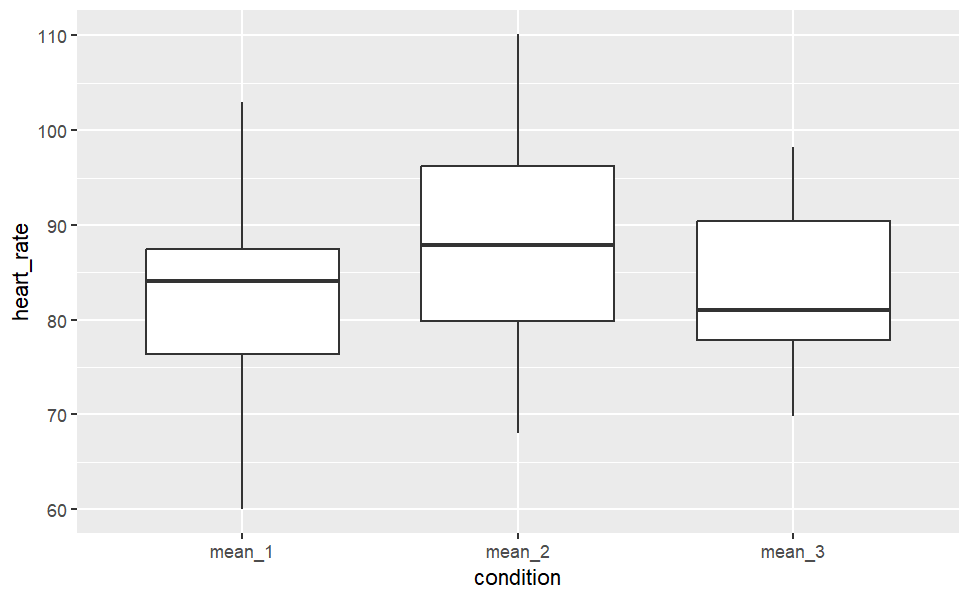
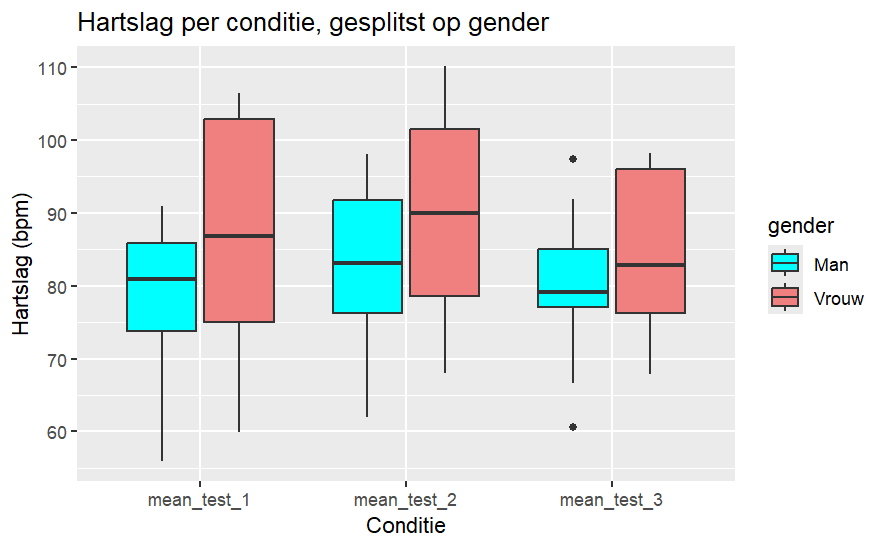
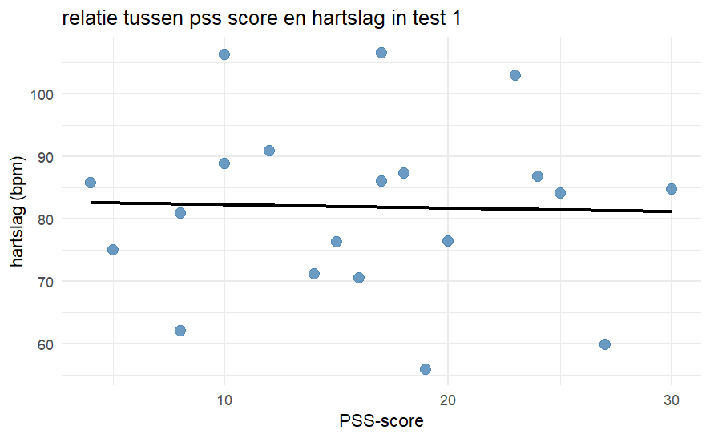
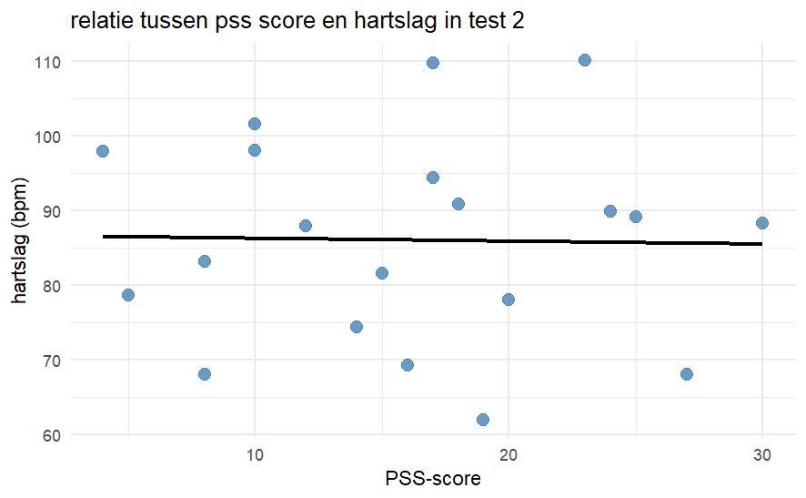
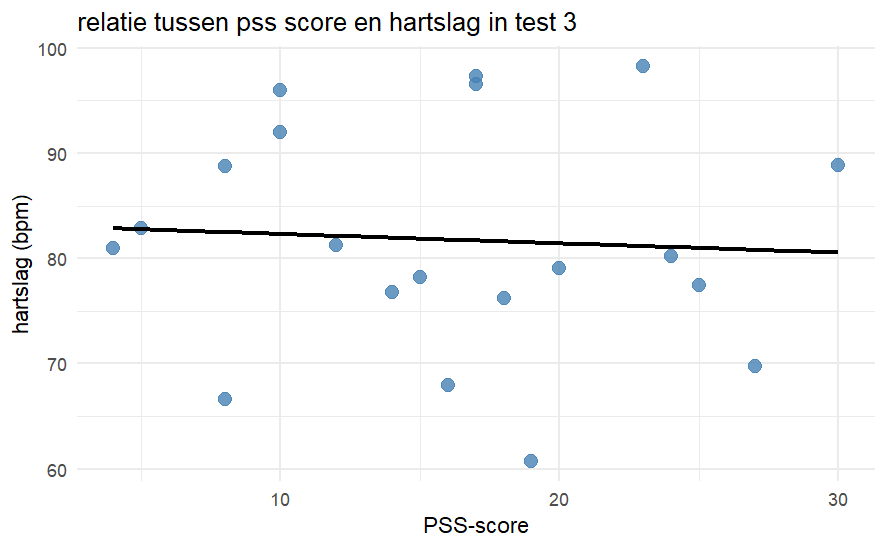

```{r setup, include=FALSE}
knitr::opts_chunk$set(echo = TRUE)
```

## introductie 
Studenten ervaren over het algemeen erg veel stress door school, zoals gebleken uit het rapport van Monitor Mentale Gezondheid en Middelengebruik Studenten hoger onderwijs (MMMS). Met ons onderzoek proberen wij de stress te meten, door de hartslag en bloeddruk te meten tijdens en na het maken van korte rekentoetsen. Deze rekentoetsen worden onder variërende tijdsdruk gemaakt.

al onze data en gegevens zijn te vinden op https://github.com/alexanderathanze/wetenschappelijke-cyclus.git

De onderzoeksvraag luidt als volgt: Heeft tijdsdruk effect op de prestatie, bloeddruk en hartslag van studenten.

onze H0 is dat studenten onder tijdsdruk niet significant meer stress ervaren. 
onze H1 is dat studenten onder tijdsdruk wel significant meer stress ervaren. 


Daarnaast hebben wij twee nevenvragen: 

Heeft de dagelijks ervaren stress invloed op de stress onder tijdsdruk?

H0: De dagelijks ervaren stress heeft invloed op de stress onder tijdsdruk.
H1: De dagelijks ervaren stress heeft geen invloed op de stress onder tijdsdruk.

Heeft sexe invloed op ervaren stress onder tijdsdruk?

H0: De sexe heeft geen invloed op de ervaren stress onder tijdsdruk.
H1: De sexe heeft invloed op de ervaren stress onder tijdsdruk. 


## Data
De data die in ons onderzoek wordt gebruikt zijn hartslag, bloeddruk en pss-score. dit is allemaal continue data. de pss-data is een nummer tussen 0 en 40 dat representeert hoeveel stress iemand in zijn dagelijkse leven ervaart. 
de data van de hartslag die gebruikt wordt is de hartslag tijdens de 3 toetsen die gemaakt worden onder geen, lichte en hoge tijdsdruk. van de hartslag zijn de gemiddeldes gepakt (mean) per toets per persoon. in ons onderzoek zijn dit 3 keer 20 waardes (een per toets per persoon). 
de data van de bloeddruk is gemeten voor de toetsen, na de toets zonder tijdsdruk, na de toets met lichte tijdsdruk en na de toets met hoge tijdsdruk. de metingen pakken zowel de bovendruk als onderdruk. dit is in ons onderzoek dus 4 keer 20 waardes voor de bovendruk en 4 keer 20 waardes voor de onderdruk. 
de data van de bloeddruk is gemeten door een omron bloeddrukmeter en de data van de hartslag is gemeten door een polar verity sense.
onze data is verzameld op de hanzehogeschool in het gebouw van Doorenveste in groningen. deze data is in (bijna) lege lokalen opgenomen. de lokalen waarin het is opgenomen zijn D1.07 en D1.08. onze data is uitsluitend van studenten.


## 20/5/2026

### doel van de dag
Vandaag is het doel om zo veel mogelijk mensen te meten. Dit wordt gedaan zoals in het protocol vermeld.

### motivatie van aanpak
Dit doel is gekozen omdat er nog veel data verzameld moet worden. Door het 
verzamelen van deze data kunnen wij zo snel mogelijk verder met ons onderzoek. 

### uitgevoerde werkzaamheden
Er zijn een aantal proefpersonen getest en gemeten zoals vermeld in het protocol.

### resultaten
Er zijn succesvol gegevens verzameld van een aantal mensen. 

### conclusie en vervolgstappen
De volgende dag moeten er nog meer mensen getest en gemeten worden.


## 21/5/2026

### doel van de dag
Vandaag is het doel om het artikel tot zover het er is (introductie,
materiaal en methoden) aan te passen zodat deze klopt en actueel is. 

### motivatie van aanpak
dit doel is gekozen omdat we het artikel nog actueel moeten maken. Dit zorgt er voor dat we een beter reproduceerbaar expirment hebben.

### uitgevoerde werkzaamheden
het protocol en de introductie zijn aangescherpt, de oude informatie is voor het grootste deel vervangen. Voor de introductie is er meer uitleg over de pss verzameld. Ook is er nog een persoon getest.

### resultaten
het protocol en de introductie zijn aangescherpt en er is succesvol een persoon getest.

### conclusie en vervolgstappen
een volgende dag/sessie moeten er nog personen getest worden voor ons onderzoek.


# 22/5/2026

### doel van de dag
eerder gemaakte werk in een repo zetten 

### motivatie van aanpak
repos zijn handiger om in terug te vinden wat er is gebeurd. Ook moet het uiteindelijk gemaakte werk in een repo ingeleverd worden. 

### uitgevoerde werkzaamheden
de meeste dingen zijn in een repo omgezet, m.u.v. rauwe data en 2 logboeken door afwezigheid van groepsgenoten

### resultaten
alle tot nu toe gemaakte bestanden zitten in de repo, m.u.v. bestanden vermeld in uitgevoerde werkzaamheden

### conclusie en vervolgstappen
alle rauwe data en logboeken moeten nog in de repo gezet worden.


##26/5/2026

### doel van de dag
de tot nu toe verzamelde data van 11 personen online opvragen en deze data filteren op tijd en hartslag. Hiervan moet in de tabel met toetsscores (wetenschappelijke_cyclus/raw_data/wetcyc.xlsx) een nieuwe rij toegevoegd worden waarin de hartslagen per situatie (geen, lage en hoge tijdsdruk) in staan.

### motivatie van aanpak
de data moet in één document in tabelvorm komen zodat deze voor verdere verwerking en statistiek goed te gebruiken is. 

### uitgevoerde werkzaamheden
er is een begin gemaakt aan het script om data mee te verwerken. De geschreven code is in de repo terug te vinden in commit hash 0967af086218ce1985df5bfbd43198639c626fd7. ik was er even tegenaan gelopen hoe ik subsets moest maken van de rauwe data, maar dat is ook opgelost. verder is er nog een testpersoon gemeten in lokaal D1.08 Door Tristan, Jasmijn en ik.

### resultaten
De geschreven code filtert tot nu toe uit een van de rauwe databestanden (wetenschappelijke_cyclus/raw_data/heartrate_1.csv) de tijd en hartslagen in bpm.

### conclusie en vervolgstappen
er moet nog veel gedaan worden. Ten eerste is onze data nog niet compleet, aangezien we afgesproken hebben om van minimaal 20 personen de data te verzamelen. daarnaast moet de poweranalyse nog gedaan worden en is de code om alle data te verwerken ook nog niet af. na deze stappen kan er pas verder gewerkt worden aan de resultaten, maar een deel van de discussie zou evt wel al gemaakt kunnen worden.


##27/5/2026

### doel van de dag
de eerder geschreven code moet in een functie gezet worden, zodat deze op alle andere documenten met de hartslag (/raw_data/heartrate_x.csv, waarin x een geheel getal). 

### motivatie van aanpak
de data moet in één document in tabelvorm komen zodat deze voor verdere verwerking en statistiek goed te gebruiken is. door weinig tijd is de stap vandaag relatief klein. 

### uitgevoerde werkzaamheden
er is van de eerder geschreven code (zie 26/5/2026 of git hash 0967af086218ce1985df5bfbd43198639c626fd7) een functie gemaakt.  verder is er nog een testpersoon gemeten door Jasmijn en ik, waardoor we nu op 13/20 personen zitten.


### resultaten
de functie is geschreven en werkzaam. de code hiervoor is terug te vinden in wetenschappelijke_cyclus/analysis/scripts/wetenschappelijke_cyclus.Rmd in git hash 2cbe08dcec567d95a80cb3c228724519cd8433a5.

### conclusie en vervolgstappen
er moeten nog 7 personen gemeten worden voor onze data, waarvan het liefst nog 1 man en 6 vrouwen. in scripts moet er nog veel geschreven worden, om onze data nog verder te filteren op tijd tijdens de test. daarnaast moet de dan gefilterde data nog in een nieuwe tabel gezet worden. ook moet de poweranalyse, resultaten en discussie nog geschreven/gedaan worden in onze paper. 


##29/5/2026

### doel van de dag
mensen testen en het eerder gemaakte script proberen te laten filteren op de testtijden

### motivatie van aanpak
dit is de volgende stap in het dataverwerkingprocess. door de testtijden uit de eerder gegenereerde gegevens te krijgen kunnen wij verder met de analyse. daarnaast is onze data nog niet compleet, dus moeten wij nog mensen testen

### uitgevoerde werkzaamheden
er is 1 persoon getest in lokaal D1.07. de test is uitgevoert door Tristan, Jasmijn en ik. voor de test liep de bloeddrukmeter leeg, waarna daar batterijen voor zijn gehaald. de testpersoon was meegelopen en heeft als correctie op de inspanning 2 extra minuten rust gekregen. verder is er gewerkt aan de code, zodat deze op testtijden kan filteren. 


### resultaten
doordat er een test is uitgevoerd, zitten we op 14/20 personen, waarvan de rest met voorkeur vrouwelijk is. verder is de code zo aangepast dat deze nu ook op testtijden kan filteren, voor meer detais zie git hash 1141ef2a9cbcddf9309e2158799d3a170df47373.

### conclusie en vervolgstappen
er moeten nog 6 personen gemeten worden, bij voorkeur allemaal vrouw. ons script moet nog verder geschreven worden, zodat deze uiteindelijk de data in de tabel met andere gegevens (raw_data/wetcyc.xlsx) kan zetten. 


## 30/5/2026
### doel van de dag
de code voor de analyse verder/af proberen te krijgen

### motivatie van aanpak
doordat we in het weekend geen mensen kunnen testen en de deadline nadert, moeten we er voor zorgen dat de analyse van data zo snel mogelijk kan nadat de data er is. om dit te kunnen doen moet het script voor de data analyse afgemaakt worden, wat de reden is voor dit doel. 

### uitgevoerde werkzaamheden
er is een stuk code toegevoegd die automatisch de hartslagen tijdens het maken van de tests filtert uit de volle meting, door middel van de genoteerde start/eindtijd. daarnaast is er een stuk toegevoegd waarmee de code de "slopes" van de trendlijn uit de data kan halen. dit is een gegeven die nodig is voor de daadwerkelijke analyse van de data. de volledige details van de toegevoegde code zijn te vinden in git hash 53eb6c59caa86d78cb510288c8c4b8e4ee606d48. 
tijdens het schrijven van deze code ben ik tegen wat dingen aangelopen. eerst had ik de code zo geschreven dat deze gehardcode de namen van de data bij langs ging in de juiste map. na het inzien dat dit niet helemaal goed is, heb ik dit veranderd (met moeite) naar een manier van inlezen waarbij hij de juiste map 'scant' voor bestanden met "heartrate" in de naam. deze code werkt nu.


### resultaten
de code voor de analyse kan nu de juiste datapunten uit de vele csv-bestanden halen en kan voor een deel van deze datapunten de slope berekenen. 

### conclusie en vervolgstappen
er moet nog verder gewerkt worden aan het programma voor data-analyse en de metingen moeten afgemaakt worden.  


## 1/6/2026
### doel van de dag
de code voor de analyse verder/af proberen te krijgen en mensen meten

### motivatie van aanpak
er moeten nog 6 mensen gemeten worden van de 20. dit moet gebeuren zodat onze data betrouwbaarder is. verder moet het script nog verder geschreven worden zodat wij een statistische test kunnen doen op de data. 

### uitgevoerde werkzaamheden
de namen van de heartrate_x.CSV bestanden is aangepast zodat deze volgens fair beter terug te vinden is. de namen van de bestanden zijn nu vormgegeven in het volgende format: yyyy_mm_dd_heartrate_x.csv. verder is er een deel in het script bijgeschreven wat de means per test per persoon uitrekent. verdere details zijn te vinden in /de_wetenschappelijke_cyclus/analysis/scripts/wetenschappelijke_cyclus.Rmd in git hash c117f13f6a36b22bd39149080d03d0d94f3e46c6. 


### resultaten
de code maakt nu ook een dataframe van de means per test per persoon. verder is het probleem met bestanden die niet in de goede volgorde gelezen worden (alfabetisch ipv testnummer) verholpen doordat de namen zijn aangepast. er zijn vandaag geen personen getest. 

### conclusie en vervolgstappen
personen testen en de code zo ver krijgen dat hier plotjes en een statistische analyse uit te halen zijn. 


## 2/6/2026
### doel van de dag
vandaag is het weer tijd voor mensen meten, met als doel de metingen af maken. dit houdt in dat er nog 6 mensen gemeten moeten worden. daarnaast moet er nog gewerkt worden aan de visualisaties, vooral het uitzoeken op welke manier wij onze data willen visualiseren en welke data wij willen visualiseren. 

### motivatie van aanpak
er moeten nog meer mensen gemeten worden om onze data nog betrouwbaarder te maken. daarnaast is het goed om een visualisatie te maken zodat onze data visueel geïnterpreteerd kan worden. 
 

### uitgevoerde werkzaamheden
er is bij de code een deel bijgekomen die ervoor zorgt dat onze means per test per persoon longer gepivot zijn, zodat onze data makkelijker is te gebruiken met ggplot. daarnaast is er van de means per test per persoon een boxplot gemaakt. ook is er gekeken naar de statistiek om de data te interpreteren, maar dat is nog niet definitief. verder zijn er nog 6 mensen gementen door Jasmijn, Tristan en Alexander in lokaal D1.07.
daarnaast is door de groep de conclusie getrokken dat de prestatie van de test niet meegenomen wordt in de analyse, omdat deze van veel meer afhangt dan alleen stress (denk aan rekenvaardigheid, computervaardigheid, discalculie), wat er voor zorgt dat wij hier geen conclusies uit zouden kunnen trekken.


### resultaten
een boxplot van de means per test.


verder is er nog een stuk code geschreven om resultaten longer te pivotten en is deze gebruikt om de boxplot te maken. de code is terug te vinden in git hash
198632641c5bba84b6cb955401502f6c7b85be56 . 

### conclusie en vervolgstappen
de data is verzameld. hier moeten nog geschikte visualisaties voor gevonden worden en de juiste analyses op losgelaten worden. als dat af is kunnen de resultaten en discussie van het onderzoek geschreven worden.


## 3/6/2026
### doel van de dag
de code voor de analyse verder/af proberen te krijgen en verder schrijven in de readme en het eindproduct

### motivatie van aanpak
we hebben nog geen statistische analyse van de data en moeten deze wel zsm proberen te krijgen. verder moet het artikel nog afgeschreven worden, of in ieder geval verder geschreven worden. ook is de readme nog niet compleet. 

### uitgevoerde werkzaamheden
in de dataframe waar de means per test per persoon zitten, zitten nu ook de gender en pss-scores van de participanten. verder is er gekeken naar de statistische test die voor onze data van toepassing zou kunnen zijn. hieruit is gekomen dat wij geen paired t-test kunnen doen, omdat onze data geen normale distributie volgen. dit is geconstateerd met een shapiro test en door de data te plotten met de qqnorm functie.
hierdoor heb ik ervoor gekozen om dezelfde soort test te doen maar dan voor niet-normale data. dit is de pairwise wilcox test.
de wilcox test is uitgevoerd op de means per test per persoon. de variabele means_test_1 zijn alle means van de eerste test, hetzelfde geld voor mean_test_2 en mean_test_3

### resultaten
uit de pairwise wilcox test kwam het volgende: 
            mean_test_1 mean_test_2
mean_test_2 0.00097     -          
mean_test_3 0.86949     0.05328    


### conclusie en vervolgstappen
uit de statistische test valt te concluderen dat het verschil tussen test 1 en test 2 significant is. ook valt er uit te concluderen dat het verschil tussen test 2 en 3, zowel als test 1 en 3 niet significant is. wat dit voor onze data betekend moet nog uitgezocht worden. 
verder moeten het artikel en de readme nog verder/af geschreven worden.


## 4/6/2026
### doel van de dag
de analyse doen van onze data in gender. dit houdt in: man ~ vrouw, wat de relatie/verschillen tussen deze twee zijn

### motivatie van aanpak
om een van onze deelvragen te beantwoorden moeten we de statistische analyse en grafiek hebben die het verschil tussen man en vrouw laat zien

### uitgevoerde werkzaamheden
er is een stuk script geschreven om de visualisatie te doen van man ~ vrouw. ook is er een stuk code geschreven om de statistische analyse tussen deze te doen per test. ook ben ik er tegen aan gelopen wat de beste manier zou zijn van statistische analyse tussen deze twee genders, waar uit is gekomen dat ik weer een wilcox test doe. dit keer moet deze test tussen de verschillende genders per test gedaan worden, zodat je het verschil ziet tussen deze genders per test. 
verdere details over het script zijn terug te vinden in git hash d4d9ac75fde21470f3e69905be8d08d91b666826

### resultaten
de boxplot van gemiddelde hartslagen in bpm per test per persoon, gesplitst op gender.


verder is er uit de statistische analyse het volgende gekomen:

voor test 1: 

data:  heart_rate by gender
W = 35, p-value = 0.2947
alternative hypothesis: true location shift is not equal to 0

voor test 2: 

data:  heart_rate by gender
W = 35, p-value = 0.2947
alternative hypothesis: true location shift is not equal to 0

voor test 3: 

data:  heart_rate by gender
W = 39, p-value = 0.4561
alternative hypothesis: true location shift is not equal to 0


### conclusie en vervolgstappen
uit deze statistische tests is te concluderen dat er geen significant verschil zit tussen man en vrouw. 
verdere stappen in ons onderzoek zijn de statistische test/grafiek van stressniveaus gemeten uit de pss10 doen. daarnaast moeten de readme van onze repo en het artikel nog verder geschreven worden.


## 5/6/2026
### doel van de dag
de code voor de analyse van de pss test en de hartslagen/minuut af krijgen

### motivatie van aanpak
om onze deelvraag voor het effect van de pss-10 test op de ervaren stress te bekijken, moet hier een grafiek van gemaakt worden en de data geanalyseerd worden. 

### uitgevoerde werkzaamheden
voor de statistische analyse is toch voor een andere methode gekozen, namelijk een anova. deze keuze is gemaakt omdat de anova de interactie tussen gender en resultaten laat zien. verder zijn er fouten uit het geschreven script gehaald. de data blijkt namelijk toch normaal verdeeld te zijn, waardoor de wilcox test niet meer gebruikt wordt maar de pairwise t toets. er zijn grafieken gemaakt voor de pss-10 toets t.o.v. de hartslag en hier is een trendlijn in getrokken. per toets is deze trendlijn gemaakt. wij gebruiken qua data analyse voor de pss-10 toets t.o.v. de hartslag de correlation test. informatie over deze test is gevonden op https://www.sthda.com/english/wiki/correlation-test-between-two-variables-in-r. 
de correlatie test is per onze tijdsdruk getoetst. volledige details zijn te vinden bij git hash 

### resultaten
de resultaten van vandaag zijn de volgende grafieken: 








verder kwamen uit de statistische correlatie tests het volgende: 

voor test 1: 

data:  df_long$heart_rate[df_long$conditie == "mean_test_1"] and df_long$pss_score[df_long$conditie == "mean_test_1"]
t = -0.12219, df = 18, p-value = 0.9041
alternative hypothesis: true correlation is not equal to 0
95 percent confidence interval:
 -0.4653801  0.4190715
sample estimates:
        cor 
-0.02878793 


voor test 2:

data:  df_long$heart_rate[df_long$conditie == "mean_test_2"] and df_long$pss_score[df_long$conditie == "mean_test_2"]
t = -0.087928, df = 18, p-value = 0.9309
alternative hypothesis: true correlation is not equal to 0
95 percent confidence interval:
 -0.4590323  0.4257037
sample estimates:
        cor 
-0.02072047 


voor test 3:

data:  df_long$heart_rate[df_long$conditie == "mean_test_3"] and df_long$pss_score[df_long$conditie == "mean_test_3"]
t = -0.25535, df = 18, p-value = 0.8013
alternative hypothesis: true correlation is not equal to 0
95 percent confidence interval:
 -0.4895832  0.3928876
sample estimates:
        cor 
-0.06007852 

### conclusie en vervolgstappen
de conclusie die uit de statistische analyse en de grafieken volgt is dat de pss-10 score geen significante correlatie heeft met de hartslag. de vervolgstappen zijn het bekijken van de data van de score en deze statistisch analyseren.


## 7/6/2026
### doel van de dag
de data van de hartslag in onze publicatie zetten onder results

### motivatie van aanpak
er moet verder gewerkt worden aan het artikel. aangezien ik het meeste qua code heb geschreven voor de analyse van de hartslagdata, heb ik de keuze gemaakt om deze zelf ook in het artikel te gaan zetten. 

### uitgevoerde werkzaamheden
er is gewerkt aan de resultaten van onze publicatie. hierin staan nu de boxplot van alle data, de boxplot die op gender gescheiden is en de scatterplots met trendlijnen voor de interactie tussen pss en hartslag. deze grafieken zijn allemaal ook voorzien van de statistiek die er achter zit en een korte uitleg over wat er te zien is in de grafieken. 

verder is er de keuze gemaakt om in plaats van een correlatie-analyse te doen op de data van de pss ~ hartslag toch te gaan voor een lineair regressiemodel, omdat deze meer zegt over de interactie i.p.v. de correlatie. details over de uitgevoerde werkzaamheden zijn te vinden in git hash ddccb84ef3b08e5c3aeed9d0244553751dd493fd.

informatie over het lineaire regressiemodel is gevonden op https://www.geeksforgeeks.org/machine-learning/ml-linear-regression/.

### resultaten
de resultaten van de lineaire regressiemodellen is als volgt:

voor test 1:
Multiple R-squared:  0.0008287,	Adjusted R-squared:  -0.05468 
F-statistic: 0.01493 on 1 and 18 DF,  p-value: 0.9041

voor test 2: 
Multiple R-squared:  0.0004293,	Adjusted R-squared:  -0.0551 
F-statistic: 0.007731 on 1 and 18 DF,  p-value: 0.9309

voor test 3: 
Multiple R-squared:  0.003609,	Adjusted R-squared:  -0.05175 
F-statistic: 0.06521 on 1 and 18 DF,  p-value: 0.8013


verder is er een groot begin gemaakt aan de resultaten

### conclusie en vervolgstappen
de lineaire regressiemodellen vertellen het volgende: 

multiple r squared: hoeveel van de gevallen de hartslag verklaard wordt door de pss-score

p value: probability, als deze groter is dan 0.05 kan de H0 niet verworpen worden, als deze kleiner is dan 0.05 kan deze wel verworpen worden.


er moet nog verder gewerkt worden aan de publicatie. hier moeten de data van de bloeddruk nog in en de discussie/conclusie moet nog geschreven worden. ook moet de abstract en de readme van onze repo nog geschreven worden. 


## 8/6/2026
### doel van de dag
de readme af schrijven

### motivatie van aanpak
om onze repo op orde te houden, moet de readme gemaakt worden. hierin moet in het kort staan wat we hebben onderzocht

### uitgevoerde werkzaamheden
de readme is verder geschreven. ik zou willen zeggen dat hij af is maar dat laat ik ter beschouwing van mijn groepsgenoten. hier zijn dingen toegevoegd als wat voor een materiaal we hebben gebruikt, onderzoeksvragen, en welke software wij hebben gebruikt om de data te analyseren. tijdens het maken van de readme ben ik er wel tegenaan gelopen wat ik er precies in moet zetten, maar dat is ook verholpen.

### resultaten
de readme is (hopelijk) af.


### conclusie en vervolgstappen
de vervolgstappen zijn het verder schrijven van de resultaten en de discussie. verder moeten de bronnen ook nog in de publicatie komen. daarnaast moet de abstract ook nog afgeschreven worden.


## 9/6/2026
### doel van de dag
de paper afschrijven en omzetten tot een pdf. hiervoor moeten de abstract, resultaten en discussie afgeschreven worden.

### motivatie van aanpak
misschien klinkt het een beetje lullig, maar om onze paper af te krijgen en om ons cijfer te krijgen moeten wij hem natuurlijk wel klaar krijgen en omzetten tot pdf.

### uitgevoerde werkzaamheden
vandaag heb ik een deel van de abstract geschreven en heb ik de readme geschreven.

### resultaten
de readme is af en de abstract is bijna af

### conclusie en vervolgstappen
we zijn klaar! jippie!

