### Introductie

Ik ga onderzoek doen naar geïnterpreteerde stress doormiddel van
bloeddruk en hartslag tijdens het maken van een rekentoets onder
verschillende tijd drukken.

### Motivatie:

Omdat stress bij het maken van toetsen een negatieve impact heeft op je
prestatie, wordt in dit onderzoek beter in kaart gebracht hoe stress
wordt ervaren tijdens het maken van toetsen onder tijdsdruk.

### Hoofdvraag:

Beïnvloedt een tijdsdruk de bloeddruk, hartslag en de prestatie?

### hoofddoel:

Onderzoeken in hoeverre tijdsdruk invloed heeft op de:

Bloeddruk voor/na het maken van rekensommen Hartslag voor/tijdens/na het
maken van rekensommen Prestatie op rekentaken (aantal goede antwoorden,
fouten, snelheid)

### Onze nevenvragen:

- Heeft dagelijks ervaren stress (door middel van een HADS of PSS
  vragenlijst) invloed op het gemeten verschil in bloeddruk, hartslag en
  prestatie?

- Is er een verschil in bloeddruk, hartslag en prestatie tussen de
  sexes?

### Data die wij verkrijgen per test persoon:

- Toestemming annoniem opslaan van gegevens
- Leeftijd
- Geslacht
- PSS-10 vragen lijst (indicatie van stress in het dagelijks leven)
- Gemeten bloeddruk voor/na elke toets in mmHg, verdeeld in bovendruk en
  onderdruk
- Gemeten hartslag tijdens de gehele test in BPM (beats per minute)
- Testscores van de 3 rekentests
- Tijd noties van toen de 3 toetsen daadwerkelijk werden afgenomen

Deze data wordt naderhand gelijk verwerkt zodat de totale score van de
testen en de PSS-10 vragenlijst wordt bewaard. De bloeddruk en hartslag
wordt opgeslagen op een account van Polar () en Omron (bloeddruk meter).

De inviduele antwoorden zijn door ons niet meer te zien nadat wij deze
data verwijderd hebben.

### Github Repo (zie voor meer info over ons onderzoek)

<https://github.com/alexanderathanze/wetenschappelijke-cyclus/tree/main>

### Waar kan ik de data vinden?

#### Op de github repo:

Route van rauwe data: raw_data/ (heart beats, blood pressure, test
scores, pss-10 )

Route van R scripts: analysis/scripts/(box/scatter/line plots for blood
pressure, heart beats, test scores and pss-10 score)

#### Gemeten data:

Wij hebben een google forms gebruikt voor het verzamelen van de data:
test scores, pss-10 en gender. Link:
<https://docs.google.com/forms/d/e/1FAIpQLSffCktOIByC5ewvc_G59jGj6tBHDxXwfUgkbbkhXhq1ks2C9w/viewform>
Link data:
<https://docs.google.com/spreadsheets/d/1rh9mKr3W5fefUMaJ8jsmBfmbxG6oYTwLyynACgPlLMI/edit?gid=1951386670#gid=1951386670>

#### Word document:

https://docs.google.com/document/d/1neSs9x7-FeuDhoVC2XdDNwmbbb750SxMuM3ma3ot6I4/edit?pli=1&tab=t.0

### Hoe kan ik de data zelf meten?

Zoals hierboven beschreven hebben we google forms gebruikt voor het noteren van de data die uit de vragenlijst komt en de rekentoets voeren we ook uit in forms.

En voor het meten van de hartslag en bloeddruk hebben we de volgende
apparaten gebruikt: - Omron bloeddruk meter (bloeddruk) - Polar verity
sense (hartslag)

En voor daadwerkelijk de data uit deze apparaten te verkrijgen moet je
de apps voor de apparaten downloaden zodat je het kan exporteren: -
Bloeddruk meter app: OMRON connect (Playstore/Appstore) - Hartslag meter
app: Polar Flow (Playstore/Appstore)

Je moet de apparaten vervolgens connecten met de bluetooth van je
device. Daarna kun je de gemeten data exporteren.

Stappen voor meten staan in het protocol: de_wetenschappelijke_cyclus
-\> publication -\> publication.Rmd

# Logboek

## 19/05/2026

### Doel:

Artikel vinden voor journal club, meet methode uittesten op
onszelf en eventueel verbeteren.

### Motivatie:

Onze meet methode is nog niet robuust en hebben we nog niet
echt uitgetest, daarom moeten we dat doen. En ik loop al achter met een
artikel kiezen voor de journal club, daarom moet ik daar vandaag naar
opzoek.

### Werkzaamheden:

Artikel gevonden voor de journal club en daarbij in teams gezet dat ik
het graag op 29 mei om half 11 presenteer. Dit artikel heb ik een tijdje
geleden al gevonden toen ik er een youtube video over keek.

Artikel titel: H-Neurons: On the Existence, Impact, and Origin of
Hallucination-Associated Neurons in LLMs en

link:<https://arxiv.org/abs/2512.01797>

Samenvatting artikel: Het artikel gaat over waar precies hallucinaties
gebeuren in een LLM model (large language model). De onderzoekers hebben
ontdekt welke neuronen in een netwerk precies zorgen voor hallucinaties
en welke juist horen bij

Ook hebben we getest op onszelf en gediscussieerd over onze meetmethode
en hebben we deze verbeterd doormiddel van noteren van starttijd toetsen
en hebben ons protocol over begeleiden van het proefpersoon tijdens de
test ook verbeterd.

### Bestanden aangepast:

Repo: -

Script: -

Data: Word document (zie bovenaan, online), google docs (online)

### Resultaten/stand van zaken:

Artikel gevonden en meetmethode op onszelf uitgetest en verbeterd.

### Conclusie en vervolgstappen:

Ik heb mijn artikel gevonden en we hebben onze meetmethode verbeterd. 
Nu kunnen we daadwerkelijk beginnen met echt meten.

## 20/05/2026

### Doel:

We moeten verder met de metingen en de introductie is nog echt niet af.

### Motivatie:

We hebben nog te weinig metingen en de introductie is nog slecht/niet volledig dus dit moet beter.

### Werkzaamheden:

We zijn verder gegaan met onze metingen. Om 10:36 en hebben klasgenoten
elk voor elk eruit gehaald om te testen. Elk van deze metingen slaan we
op doormiddel van het exporteren van een google forms. Ondertussen
noteren wij de starttijd van elk toetsje erbij ook in excel. En halen we
de data op van de bloeddruk- en hartslagmeter door deze apparaten
geconnect te hebben met beide apps van Polar en .

Ondertussen heb ik gewerkt aan mijn logboek en heb ik een stukje
informatie opgezocht over wat bloeddruk inhoudt en dit verwerkt in de
intro van ons artikel met bronvermelding. Bron:
<https://www.hartstichting.nl/oorzaken/bloeddruk>

Ook heb ik een stukje geschreven over de hartslag met de volgende
bronnen:
<https://www.hartstichting.nl/gezond-leven/hartslag/normale-hartslag>
[9] - hartslag
<https://www.hartstichting.nl/hart-en-vaatziekten/bouw-en-werking-hart>
[10] - hart werking
<https://www.ahealthylife.nl/medisch-woordenboek/hf/> [11] - hartslag
afkorting

### Bestanden aangepast:

Repo: -

Script: -

Data: Word document (zie bovenaan, online), google docs (zie bovenaan, online)

### Resultaten/stand van zaken:

Stukje geschreven over hartslag en over bloeddruk waarin wordt uitgelegd wat een hartslag is en wat de bloeddruk inhoudt
(bovendruk/onderdruk). Ook hebben we een groot aantal metingen gedaan door één voor één onze klasgenoten te meten.

### Conclusie en vervolgstappen:

Nu de introductie bijna af is kunnen we verder met metingen en bedenken wat er nog meer moet gebeuren. Zoals wat voor plotjes we gaan gebruiken en welke statistische analyses we nodig hebben. Wel moet ik nog een hypothese schrijven in onze introductie.

## 21/05/2026

### Doel:

Bezig met artikel verder uitwerken, voornamelijk de de puntjes op de i zetten van de introductie en meten en materialen.

### Motivatie:

We hebben de introductie en meten en materialen nog niet compleet af dus dit moet af zijn. Daarom ga ik hier nog kort mee bezig.

### Werkzaamheden:

We waren in de ochtend begonnen met beter leren schrijven. Een abstract
beter leren schrijven. Het onderwerp, uitkomsten en conclusie moest je
zelf allemaal verzinnen, vervolgens werden tussen 3 artikel, 1 gemaakt
door ai, 1 echt artikel online en je eigen verzonnen artikel. De persoon
met de meeste punten kreeg een chocolade letter.

Daarna heb ik gewerkt aan een stukje schrijven over de pss-10 test met
al bestaande bronnen in het document en heb ik referenties aangepast.
Dit kun je terug vinden in de repo. Ook heb ik een korte hypothese
geschreven op basis een vergelijkbaar artikel
(<https://minds.wisconsin.edu/handle/1793/80216>) dat wij aan het
schrijven zijn, waar uit kwam dat er niet een significant verschil is in
bloeddruk en hartslag. Wel had dat artikel een andere methode van meten
gebruikt dan wij dat hebben gedaan.

### Bestanden aangepast:

Repo: -

Script: -

Data: Word document (zie bovenaan, online)

### Resultaten/stand van zaken:

Ik heb een korte hypothese geschreven op basis van een vergelijkbaar ander artikel. 
Verder niet veel kunnen doen, vanwege in de les andere activiteit.

### Conclusie en vervolgstappen:

Ik heb dus een korte hypothese geschreven, maar verder niet veel vanwege andere activiteit in de les. 
Wat we voor de volgende keer moeten doen is echt beginnen met kijken wat we precies met onze data willen doen
en hoe we dit precies doen in R. 

## 22 t/m 25 mei

22 mei was ik ziek en daarna was het pinkster weekend.

## 26/05/2026

### Doel:

Aan het einde van de dag nog een meting doen van een meid. Begin
maken aan de R code voor ons onderzoek. Logboek verbeteren op basis van
feedback en van journal club artikel een presentatie maken.

### Motivatie:

Moeten nog genoeg metingen doen om te komen bij de 20
metingen. En moeten nog code schrijven voor onze statistische analyse.

### Werkzaamheden:

Bezig gegaan met deel 2 van de FAIR. Een repository was aangemaakt op
github door Alexander op 22 mei:
<https://github.com/alexanderathanze/wetenschappelijke-cyclus/tree/main>

Hebben gekeken naar eventuele oplossingen voor hoe wij onze data gaan
verwerken en wat we nodig hebben voor een juiste conclusie van ons
onderzoek. En hebben een meting gedaan.

### Bestanden aangepast:

Repo: <https://github.com/alexanderathanze/wetenschappelijke-cyclus/tree/main>

Script: -

Data: docs/FAIR-checklist.docx, google docs (zie bovenaan, online)

### Resultaten/stand van zaken:

We hebben nu het 2de deel ingevuld van de FAIR-checklist als het goed is. 
En we hebben een meting gedaan.

### Conclusie en vervolgstappen:

Ik heb minder gedaan dan ik wilde doen. Maar we hebben een
meting gedaan aan het einde van de dag. En ook gekeken naar eventuele
manieren van visualiseren, alleen hier waren we nog niet compleet uit
gekomen, want wij wisten niet precies wat wij statistisch uit onze data
konden halen en hoe/wat de beste manier daarvan is.

Voor de volgende dagen moeten we toch echt bezig met de R code gaan schrijven.

## 27 t/m 28 mei

### Doel:

Bezig met ons onderzoek, maar vooral bezig met de journal club,
want ik heb op 29 mei een presentatie daarvan.

### Motivatie:

Ik heb vrijdag 29 mei een presentatie over hallucinaties in
LLM's en deze presentatie moest al worden ingeleverd op 27 mei op 9.00
's ochtends. Artikel: <https://arxiv.org/abs/2512.01797>

### Werkzaamheden:

Ik was erg ziek en moest de presentatie maken. Ik heb het artikel goed
doorgelezen, ook was er een in-depth youtube video over gemaakt:
<https://www.youtube.com/watch?v=1ONwQzauqkc>. Vervolgens heb ik voor
plaatjes en feitjes ook nog andere bronnen opgezocht:

Main artikel: Gao, C. e.a. (2025). H-Neurons: On the Existence, Impact,
and Origin of Hallucination-Associated Neurons in LLMs.
arXiv:2512.01797.

Informatie eromheen: Stanford HAI (2026). 2026 AI Index Report –
Responsible AI.
hai.stanford.edu/ai-index/2026-ai-index-report/responsible-ai
Artificialanalysis.ai (2026) - AA-Omniscience: Knowledge and
Hallucination Benchmark
<https://artificialanalysis.ai/evaluations/omniscience> Bao et al.
(2025). DeepSeek-R1 Hallucinates More Than DeepSeek-V3. Kalai, A. et al.
(2025). Why Language Models Hallucinate. arXiv:2501.06521. Chelli, M. et
al. (2024). Hallucination Rates and Reference Accuracy of ChatGPT and
Bard. JMIR. <doi:10.2196/53164>

### Bestanden aangepast:

Repo: -

Script: -

Data: downloads/H-Neurons_Presentatie_v2.pptx (lokaal)

### Resultaten/stand van zaken:

Presentatie gemaakt en ingeleverd voor 29 mei, maar niet bezig geweest met ons onderzoek.

### Conclusie en vervolgstappen:

Niet bezig geweest met ons onderzoek, dus daar moet ik volgende dagen echt mee aan de slag.

conclusie: Prima presentatie gemaakt over het artikel, niet echt bezig
geweest met het onderzoek helaas.

## 29/05/2026

### Doel:

Presentatie over Hallucinatie in LLM modellen geven en nog een meting doen.

### Motivatie:

Presentatie moet ik geven en we hebben nog niet genoeg
metingen gedaan. Want we moeten nog 20 metingen doen en hebben er maar
14.

### Werkzaamheden:

Hele dag presentaties gehad totdat ik aan de beurt was als laatste. De presentatie ging wel oké.
Na de presentaties hebben we nog 1 meting gedaan. En dit opgeslagen in de repo.

### Bestanden aangepast:

Repo: <https://github.com/alexanderathanze/wetenschappelijke-cyclus/tree/main>

Script: -

Data: google docs (zie bovenaan, online)

### Resultaten/stand van zaken:

Presentatie achter de rug en nog weer een meting erop, zitten nu op
14 metingen als het goed is.

### Conclusie en vervolgstappen:

Wij hebben de gehele dag op school presentaties gedaan en na
de les hebben we nog een meting gedaan van een man en de batterijen
vervangen van het bloeddruk meter apparaat. Presentatie ging prima, was
aantal dingen ondertussen vergeten waardoor ik er later nog op terug
moest komen. Nu dit onderdeel is afgerond gaan we verder met meer metingen, de laatste 6 en gaan we verder met de code schrijven in R om onze data te analyseren.

## 31/05/2026

### Doel:

R code schrijven voor de data uit de bloeddruk meter.

### Motivatie:

Wij hebben nog lang niet alle R code geschreven, dus wij moeten dat zo
snel mogelijk doen. Ik persoonlijk ga bezig met de data uit de bloeddruk
meter.

### Werkzaamheden:

Bezig gegaan met R script voor de bloeddruk data. Ik heb substantieel
niet veel gemaakt, het was vooral een beetje een paar dingen uitvogelen
en had even problemen met de data importeren, want dat lukte niet. Dat
was uiteindelijk wel gelukt.

### Bestanden aangepast:

Repo: <https://github.com/alexanderathanze/wetenschappelijke-cyclus/tree/main>

Script: analysis/scripts/bloodpressure.rmd (repo)

Data: -

### Resultaten/stand van zaken:

Bloeddruk bestand kunnen inlezen en wat dingen uitgevogeld rondom R.

### Conclusie en vervolgstappen:

Een klein begin kunnen maken, alleen in de trein was het zo druk dat ik
moest staan en niet echt bezig kon gaan. Volgende keer bezig gaan met R code schrijven voor
daadwerkelijk iets doen met de ingelezen data.

## 1/06/2026

### Doel:

Verder gaan met R code schrijven voor de data van de bloeddruk meter en
bespreken wat voor plotjes we moeten maken voor de rest. Eventueel
verder meten.

### Motivatie:

Ik heb de code ervoor nog lang niet af en had maar een begin gemaakt,
het moet af dus ik moet ermee bezig. Ook moeten we samen bespreken welke
plotjes van waarde zijn voor ons onderzoek.

### Werkzaamheden:

Ik heb voornamelijk de data van de bloeddruk in de juiste volgorde gezet
en handmatig aangepast in het bestand: bloodpressure.xlsx, want er zaten
een aantal metingen tussen die niet correct waren gegaan en die moesten
er dus uit. Dit lukte in het begin niet goed, want excel deed een beetje
moeilijk, maar dat was uiteindelijk gelukt. Hierna heb ik de data eruit
gehaald met indexes, aangezien we 4 metingen hebben per persoon heb je 4
rijen die voor hetzelfde persoon zijn: rust, toets 1, toets 2 en toets
3. Deze heb ik onderverdeeld in verschillende vectoren en ik heb het
verschil berekend van elk van de toetsen vergeleken met de rust
bloeddruk. Ik heb dit gedaan voor zowel de bovendruk(systolisch) als de
onderdruk (diastolisch). Ook heb ik uitgezocht welke library's ik
gedownload moet hebben voor het verder verwerken van de data. Zoals tidr
en ez. Deze heb ik alvast geïnstalleerd in mijn R.

### Bestanden aangepast:

Repo: <https://github.com/alexanderathanze/wetenschappelijke-cyclus/tree/main>

Script: analysis/scripts/bloodpressure.rmd (repo)

Data: raw_data/bloodpressure/bloodpressure.xlsx (repo)

### Resultaten/stand van zaken:

Bovendruk en onderdruk en verschil in boven en onder druk opgeslagen in
verschillende vectoren. Zie het script, bloodpressure.rmd. En ook dus
onjuiste metingen uit de bloodpressure.xlsx gehaald. We hebben niet
gemeten uiteindelijk.

### Conclusie en vervolgstappen:

Nu ik de juiste data in de juiste vectoren heb kan ik beginnen met
plotten en daar statische conclusies uittrekken.

## 2/06/2026

### Doel:

Verder gaan met R code schrijven voor de data van de bloeddruk meter. Ik
wil het liefst al simpele plotjes eruit krijgen. En we gaan vandaag de
laatste 6 metingen doen zodat alle data compleet is en we volledig aan
de slag kunnen met

### Motivatie:

IK heb de code voor het maken van de plotjes nog niet af en moet nog
precies uitzoeken hoe ik dat kan doen en welke plotjes daar handig voor
zijn. En onze metingen zijn nog steeds niet compleet dus dit moet
vandaag echt af zijn.

### Werkzaamheden:

Ik heb gewerkt aan de R code voor de bloeddruk. Hiervoor heb ik eerst
een dataframe gemaakt van de sytolische en diastolische bloeddruk per
persoon zodat ik er plotjes van kan maken. Ik had hier eerst simpele
lijn plotjes van gemaakt om het wat te proberen. Deze zijn terug te
vinden in: bloodpressure.rmd. Voor de diastolische bloeddruk:

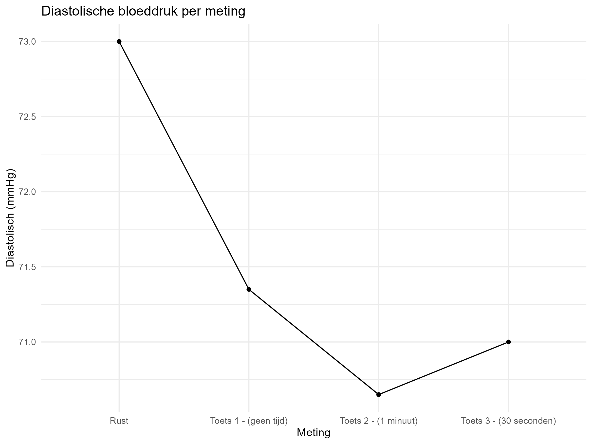 Voor de
systolische bloeddruk:

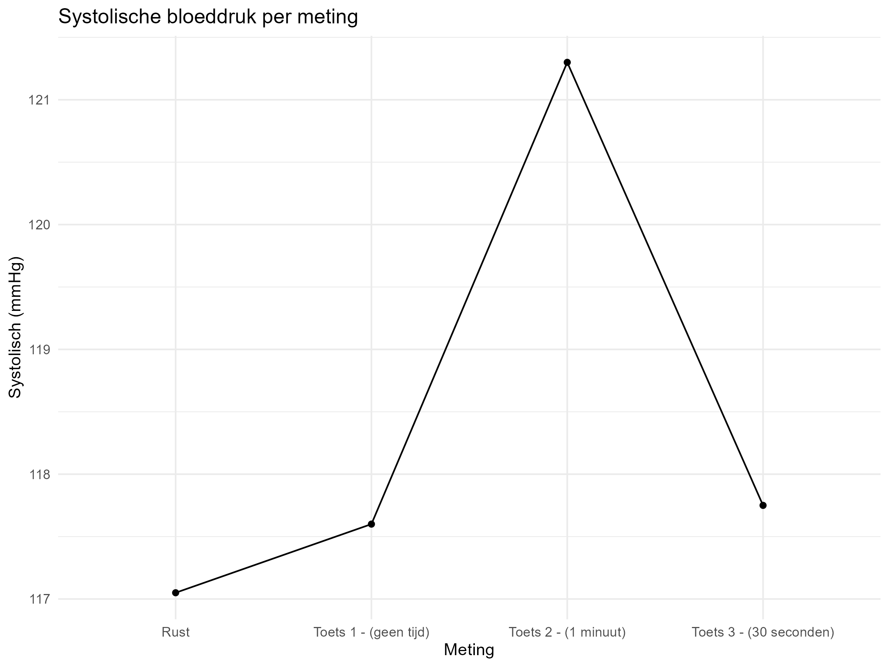 Echter na
het bespreken met mijn teamgenoten over de uitkomsten van de lijnplotjes
hadden we toch besloten dat je meer kon halen uit boxplotjes. Hierna
hebben wij onze laatste 6 metingen gedaan.

### Bestanden aangepast:

Repo: <https://github.com/alexanderathanze/wetenschappelijke-cyclus/tree/main>

Script: analysis/scripts/bloodpressure.rmd (repo)

Data: -

### Resultaten/stand van zaken:

Simpele lijnplotjes gemaakt van de systolische en diastolische
bloeddruk. Hiervoor moest ik alleen eerst wel een data frame maken. Ook
hebben we onze laatste metingen gedaan en nu is de bloeddruk data
compleet.

### Conclusie en vervolgstappen:

Nu ik heb uitgevogeld hoe ik plotjes moet maken en wat daarvoor nodig
is, kan ik bezig met het echte werk. Boxplotjes maken en daar
statistische analyses op uitvoeren om te weten welke data daadwerkelijk
significant is.

## 3/06/2026

### Doel:

Boxplotjes maken van de bloeddruk data en daar al eventueel analyses op
uitvoeren. Nieuwe data van de metingen van gisteren implementeren in het
bloodpressure.xlsx bestand. Beter bespreken wat voor plotjes er nog meer
gemaakt moeten worden i.v.m. met het gender, de pss-10 scores en de
testscores.

### Motivatie:

Nu ik een beetje een idee heb van hoe ik plotjes moet maken kan ik bezig
met de daadwerkelijke plotjes voor de bloeddruk. Ook hebben we nog niet
geheel duidelijk welke plotjes we nou in ons uiteindelijke publicatie
allemaal willen hebben. Ook moet ik uitzoeken hoe je een statische
analyse ergens op uitvoerd.

### Werkzaamheden:

We hebben goed besproken wat we nog voor plotjes moeten maken. En kwamen
erachter dat voor elk plotje dat we maken we ook een split moeten maken
voor het gender. Ook moeten we de pss-10 data uitzetten tegen de rest
van de plotjes om eventueel te kunnen zeggen dat er een verhoogde
ervaren stress is bij mensen die maandelijks ook meer stress ervaren in
hun leven. Dit moet dus bij de bloeddruk en hartslag allebei gebeuren en
deze plotjes moeten ook weer worden gesplits in gender, om te zien of
daar uberhaupt een verschil in zit. Tegelijkertijd heb ik gewerkt aan de
boxplotjes van de bloeddruk en ik heb de nieuwe data die we gisteren
hadden gemeten aangepast in het bloodpressure.xlsx bestand. Voor de
nieuwe dat moest ik de index op waar hij de rust, toets 1 etc. pakt
aanpassen aangezien de vorige data maar van 1 persoon 1 data punt had
waardoor alle data punten met 1 verschoven. Nu het compleet is moet ik
dat weer terug veranderen zodat hij op de juiste index de juiste data
pakt. En voor de boxplotjes kwam ik erachter dat je een dataframe long
moet maken, dus dat heb ik gedaan in bloodpressure.rmd. Ook heb ik dus 2
boxplotjes gemaakt 1 van de systolische en 1 van de diastolische
bloeddruk.

Diastolische boxplot:

Systolische boxplot:
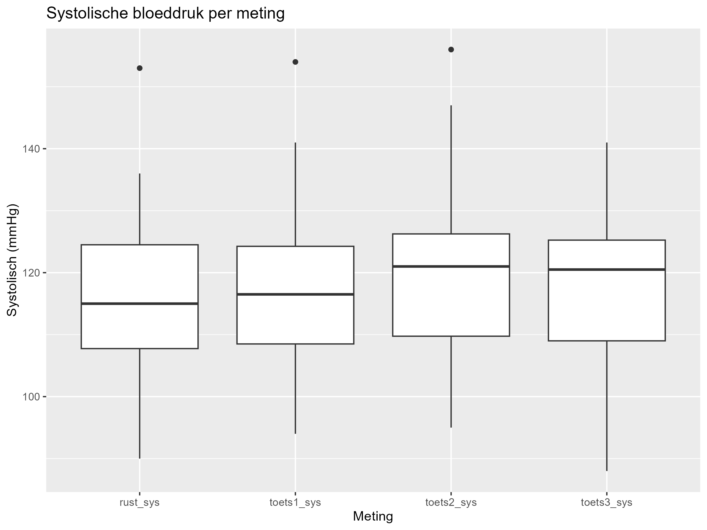
### Bestanden aangepast:

Repo: <https://github.com/alexanderathanze/wetenschappelijke-cyclus/tree/main>

Script: analysis/scripts/bloodpressure.rmd (repo)

Data: raw_data/bloodpressure/bloodpressure.xlsx (repo)

### Resultaten/stand van zaken:

Boxplotjes gemaakt van de diastolische bloeddruk en de systolische bloeddruk. Voor de laatste keer bloodpressure.xlsx aangepast.
Data frame long gemaakt en index veranderd van waar het de juiste data uit bloodpressure.xlsx uit pakt.

### Conclusie en vervolgstappen:

Nu heb ik boxplotjes gemaakt, goed besproken wat voor plotjes we nog moeten maken voor welke data. Data aangepast voor de laatste keer. Nu moet ik alle plotjes nog splitsen op gender en de pss-10 data nog uitzetten tegen de bloeddruk. Ook moet ik op elk plotje nog een statische analyse uitvoeren.

## 5/06/2026

### Doel:

Uitzoeken hoe ik mijn data kan splitsen op gender en hoe ik daar statische analyses op uitvoer.
Ook plotjes maken van pss-10 test uitgezet tegen de bloeddruk. 

### Motivatie:

Nu ik goed weet wat er nog moet gebeuren kan ik daarmee aan de slag. Er moet namelijk nog veel gebeuren, kwamen we een paar dagen geleden achter. Er moeten nog voor veel verschillende dingen plotjes worden gemaakt. En dat moet echt af want we moeten beginnen met ons artikel samenstellen en alles afronden.

### Werkzaamheden:

Ik heb met alexander nog even goed nabesproken wat we moesten doen. Ik moet nog apart plotjes maken voor beide genders en de bloeddruk nog uitzetten tegen de pss-10 score. Terwijl hij dit ook gaat doen, maar dan voor de hartslag. En hij is al bezig gegaan met de analyses ervoor. Ik heb dus beide bloeddruk plotjes, systolische en diastolische, gesplits op gender. 
Zoals je hier kunt zien: 

Diastolische bloeddruk boxplot op gender:

Systolische bloeddruk boxplot op gender:

Vervolgens heb ik hier een statistische analyse op uitgevoerd en ook op de gecombineerde normale boxplotjes van de bloeddruk:

Diastolische bloeddruk analyse:

Eerst wordt gekeken of de data normaal verdeeld is doormiddel van de shapiro en de qqnorm test. Deze waren normaal verdeeld, dus de volgende stap, de ezANOVA test. Hier kwam dit uit voor de normale boxplotjes van de diastolische bloeddruk: 

A repeated measures ANOVA showed no significant effect of measurement type on diastolic blood pressure,
F(3, 57) = 2.11, p = .110, ges = .009, so we will not perform a paired T test

(In het script heb ik alles in het engels geschreven. Hier in het Nederlands, want dat is wat makkelijker schrijven.)

En dit kwam eruit voor de genders:

gender p = 0.055~ so not significant yet, but very borderline. Maybe worth mentioning in the final report that
Woman tend to show a higher diastolic blood pressure than men.
meting p = 0.105~ still the same, no significant difference across the measurements
gender:meting p = 0.266~ no significant change, genders respond the same way across measurements. 

Systolische bloeddruk analyse:

All p value's of 1.000 or above 0.05 are not significant. That there was a significant change
Between rust_sys and toets2_sys and between toets2_sys and toets1_sys. Both P-value's < 0.05.
Conclusion: toets 2 (1 minuut) caused a significant difference

En voor de genders:

gender p = 0.116~ so not significantly different systolic bloodpressure overall between the 2 genders
meting p = 0.020 still the same significant difference across the measurements (driven by toets2, see T test above)
gender:meting p = 0.793 no significant change, genders respond the same way across measurements. 

Daarna heb ik ook al de plotjes gemaakt waarbij de pss-10 test wordt uitgezet tegen de bloeddruk:
Hiervoor heb ik de delta berekend per toets, dus het verschil vergeleken met de rust bloeddruk. 
Dat komt neer op 6 plotjes, 3 voor diastolische bloeddruk en 3 voor systolische bloeddruk.

Voordat ik dat deed had ik nog een statistische analyse uitgevoerd op de data die in de plots gaat: 

Eerst had ik de shakiro test uitgevoerd op elke delta van elke toets en van de pss-10 test, daar kwam dit uit:

The P value of every delta of every test is normal, except of test 2 for the diastolic blood pressure
That's why we run a spearman test for that instead of pearson.  

Omdat de delta van test2 dus niet normaal verdeeld was had ik dus een spearman voor test 2 gedaan en op de rest de pearson.

Hieruit kwam dat geen enkel van de grafieken een significant iets vertoonde. Er is geen verband tussen de pss-10 test en een verhoging of verlaging in bloeddruk (ofwel ervaren stress)

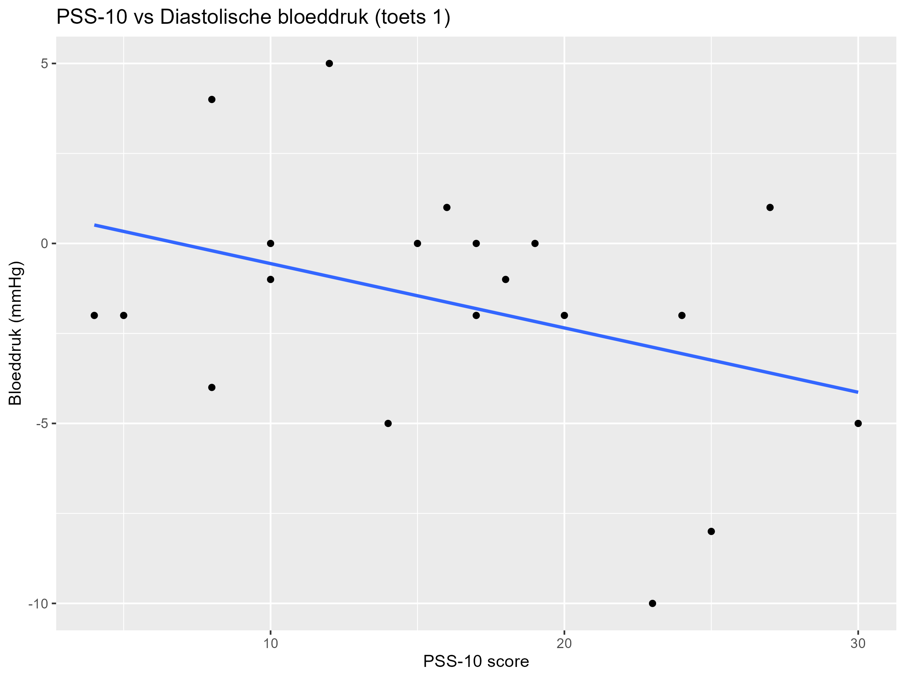
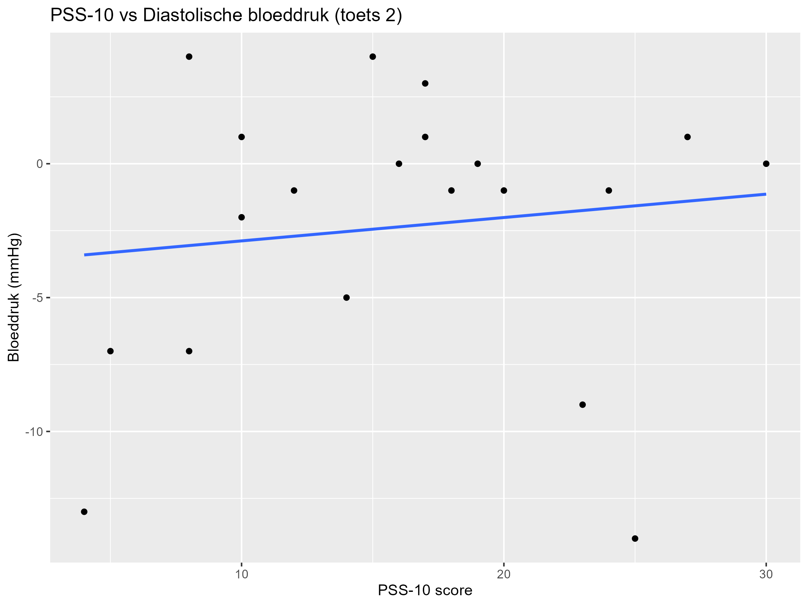
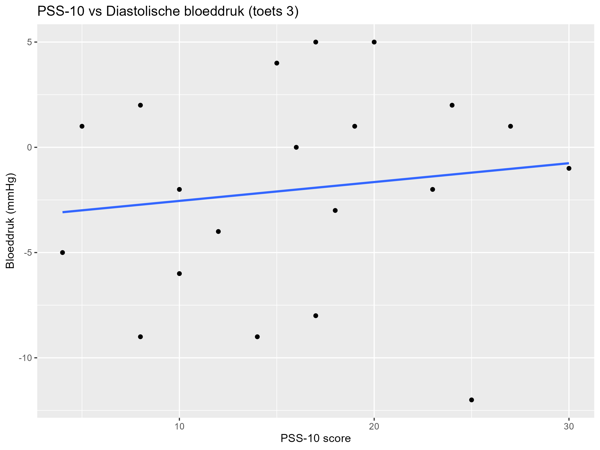
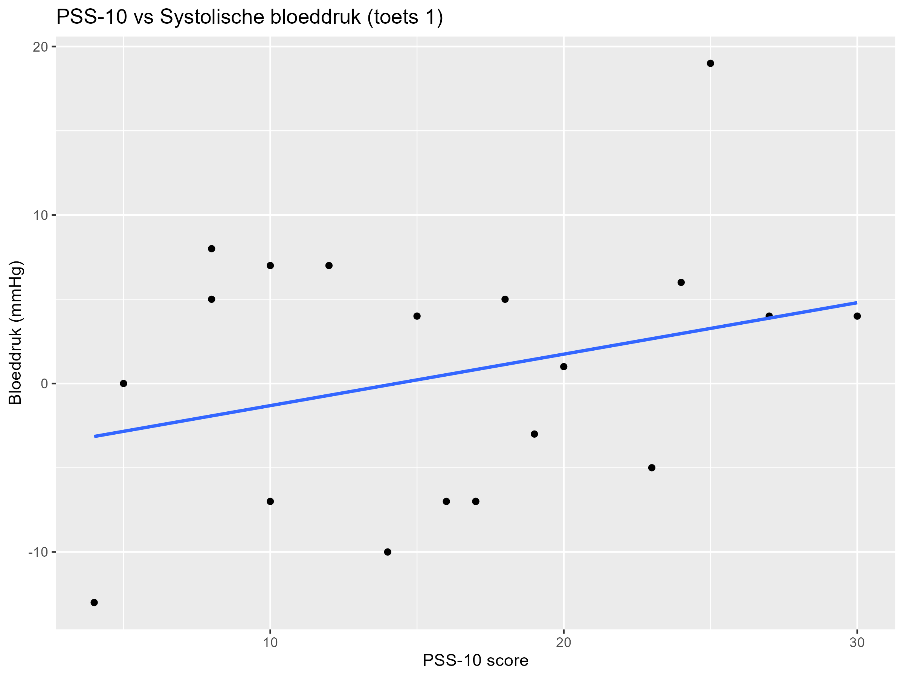
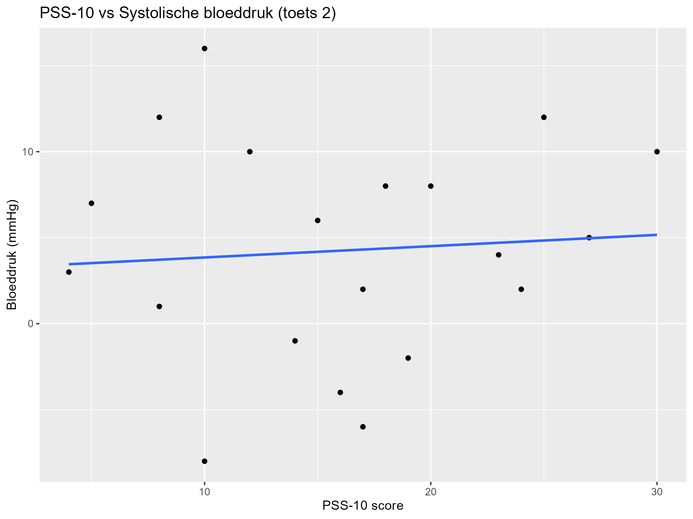
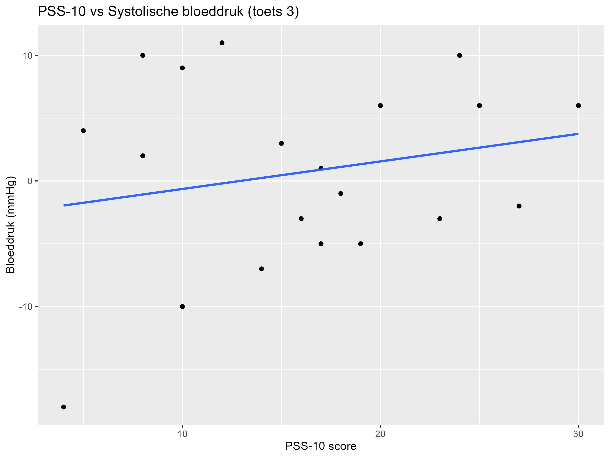
Daarna heb ik hetzelfde gedaan, maar dan weer gesplitst op gender. Nu zitten alle drie de toetsen bij elkaar.

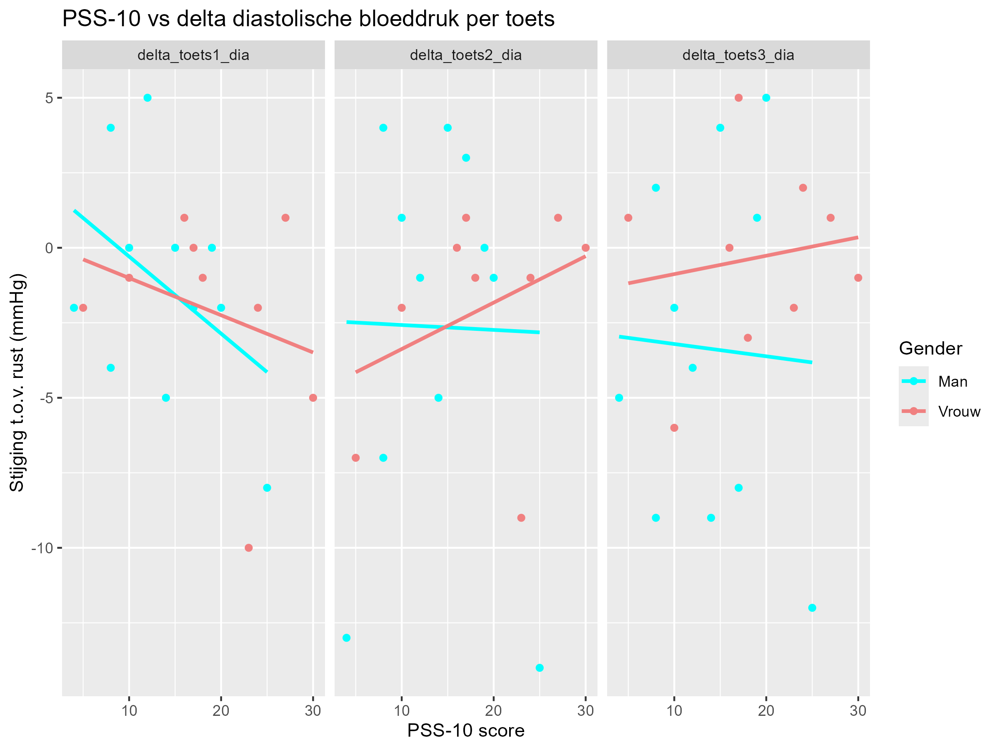
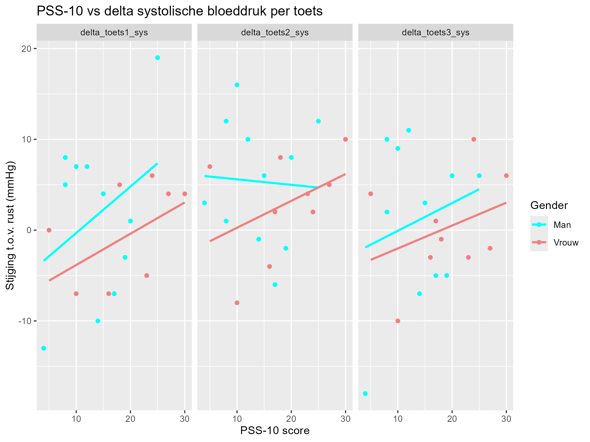
### Bestanden aangepast:

Repo: <https://github.com/alexanderathanze/wetenschappelijke-cyclus/tree/main>

Script: analysis/scripts/bloodpressure.rmd (repo)

Data: -

### Resultaten/stand van zaken:

Boxplotjes gemaakt van de bloeddruk maar geplit op gender. Volledig statistische analyse hierop uitgevoerd en van de normale boxplotjes. Scatterplotjes gemaakt van de bloeddruk uitgezet tegen de pss-10 score. Ook hiervan gesplit op gender. En (bijna) volledige statistische analyse hierop gedaan. Ook logboek aanzienlijk veel aangepast, maar je gaat natuurlijk niet schrijven over je logboek in je logboek, dat is een beetje raar.

### Conclusie en vervolgstappen:

Nu ik de meeste plotjes af heb voor de bloeddruk is het klaar, alleen moet ik nog een statistische analyse doen op de scatterplots die op gender gesplit zijn. Zodra dat gebeurd is moet ik alles verwerken in mijn logboek en de resultaten in het artikel verwerken. Ook moet ik bezig met de Abstract schrijven.

## 7/06/2026

### Doel:

Verder met het laatste beetje R code en bezig met het artikel. Ook moet ik mijn logboek aanzienlijk veel bijwerken.

### Motivatie:

Logboek is nog niet volgens hoe het moet. En ik heb de R code ook nog niet volledig af. En de resultaten en conclusie en discussie van het artikel moeten nog geschreven worden. 

### Werkzaamheden:

Ik ben pas in de avond in de trein en bus ermee bezig gegaan. En ik wilde eerst mijn logboek af hebben. Ik ben daar dus de gehele tijd meebezig geweest en kwam niet toe aan de rest. Ik heb bij elke dag duidelijk een doel, motivatie, werkzaamheden, bestanden aangepast, resultaten/stand van zaken en conclusie en vervolgstappen gezet. Ik heb voor dag 5, 4 en 3 van juni alle gemaakte plotjes als plaatjes erin gezet.

### Bestanden aangepast:

Repo: <https://github.com/alexanderathanze/wetenschappelijke-cyclus/tree/main>

Script: -

Data: analysis/logboek_tristan/logboek_tristan.Rmd (repo)

### Resultaten/stand van zaken:

Logboek stuk verder af, maar had niet heel lang de tijd. Niet bezig geweest met de rest van het onderzoek.

### Conclusie en vervolgstappen:

Ik ben dus bezig geweest met mijn logboek en heb het voor een deel af gekregen, maar ook niet helemaal. Ik heb ook niet kunnen werken aan de rest van het onderzoek, dus abstract, resultaten en conclusie & discussie.

## 8/06/2026

### Doel:

Bezig gaan met abstract, resultaten en conclusie & discussie. En logboek afmaken. En het laatste stukje code in R wat betreft de statistische analyse over de pss-10 test uitgezet tegen de bloeddruk en gesplitst op gender.

### Motivatie:

Inleverdatum is morgen al en er moet nog veel af. Logboek neemt alleen aanzienlijk veel tijd in, heel heel veel typen. Dus dat moet ik vandaag als eerste af hebben zodat dat uit de weg is. De rest komt daarna en moet ik ook echt mee bezig. 

### Werkzaamheden:

Vandaag is voornamelijk een herhaling van gister, alleen dan langer. Veel langer. Heb zo'n 2,5 uur aan het logboek gewerkt. Dat duurde extreem lang, maar nu is het allemaal wel bijgewerkt. 

### Bestanden aangepast:

Repo: <https://github.com/alexanderathanze/wetenschappelijke-cyclus/tree/main>

Script: analysis/scripts/bloodpressure.rmd (repo)

Data: analysis/logboek_tristan/logboek_tristan.Rmd (repo), word document (zie bovenaan, online) 

### Resultaten/stand van zaken:

### Conclusie en vervolgstappen:

## 9/06/2026

### Doel:

### Motivatie:

### Werkzaamheden:

### Bestanden aangepast:

Repo: <https://github.com/alexanderathanze/wetenschappelijke-cyclus/tree/main>

Script: analysis/scripts/bloodpressure.rmd (repo)

Data: raw_data/bloodpressure/bloodpressure.xlsx (repo)

### Resultaten/stand van zaken:

### Conclusie en vervolgstappen:

