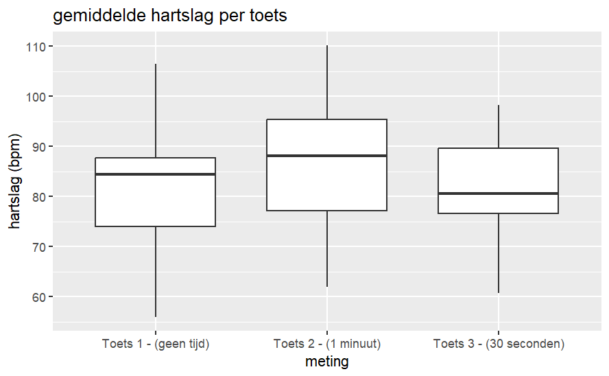
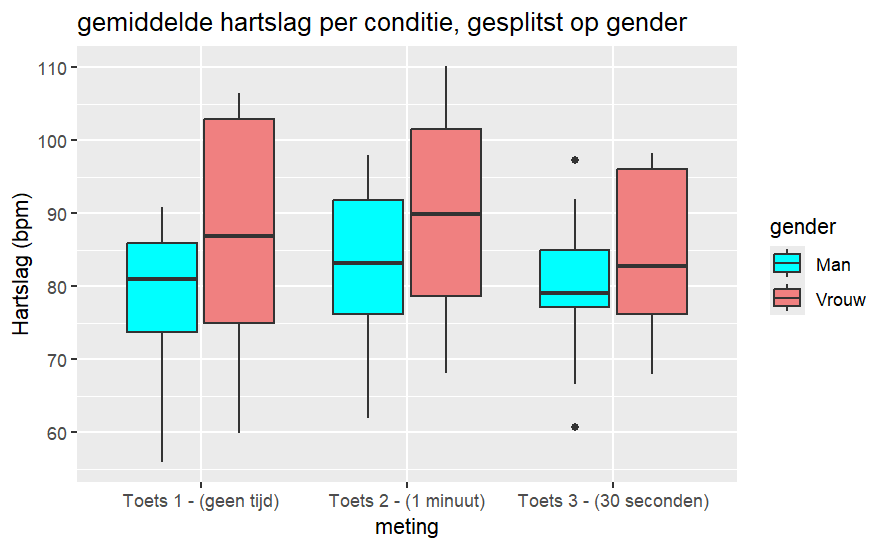
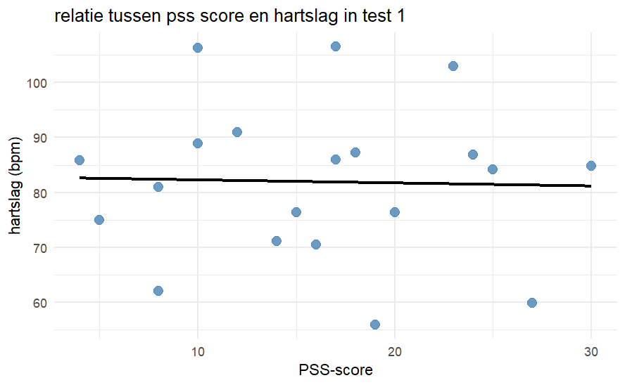
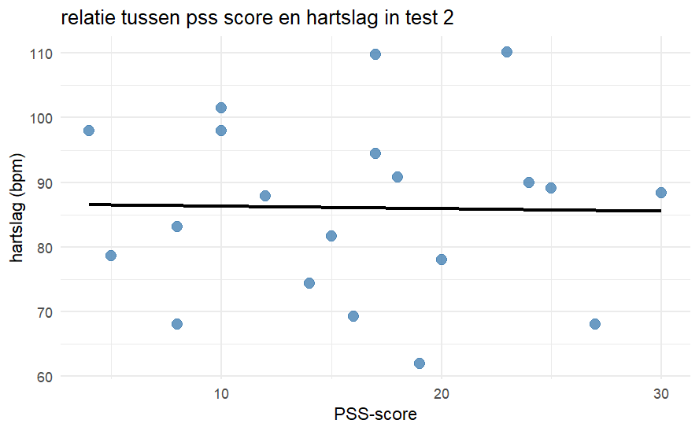
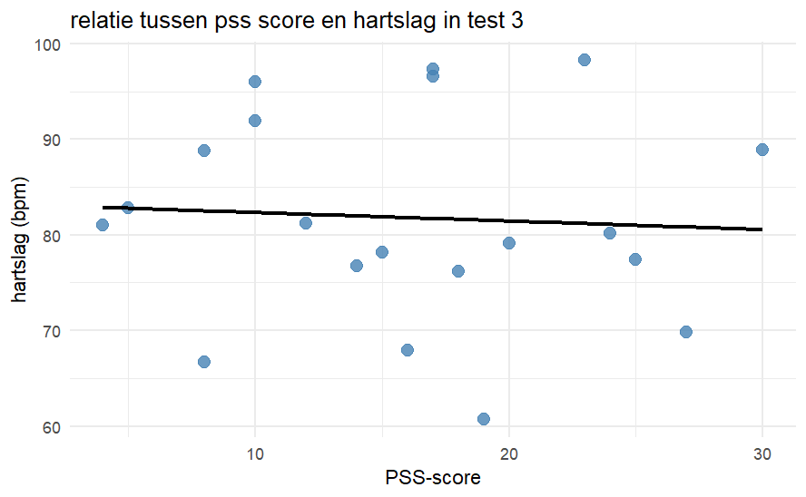

```{r setup, include=FALSE}
knitr::opts_chunk$set(echo = TRUE)
```

## Abstract

Veel studenten ervaren stress tijdens toetsen, en dit heeft een negatieve invloed op hun prestatie. In dit onderzoek is onderzocht of de tijdsdruk tijdens toetsen invloed heeft op de ervaren stress. Dit is gemeten door de hartslag, bloeddruk en prestatie. 20 leerlingen maakte drie rekentoetsen onder oplopende tijdsdruk (geen tijdsdruk, 1 minuut en 30 seconden voor 20 kleine rekensommen), terwijl er continu hartslag werd gemeten via een Polar Verity Sense en de bloeddruk na elke test met een Omron bloeddrukmeter. Ook werd de dagelijks ervaren stress gemeten door een PSS-10 test

Uit de resultaten bleek dat de hartslag alleen een significant verschil had tussen geen en lichte tijdsdruk(p=0.00069) en tussen licht en hoge tijdsdruk(p=0.02253) maar niet tussen geen en hoge tijdsdruk ( p =0.92782). Dit geeft aan dat er geen lineaire fysiologische respons is, mogelijk door gewenning. Er werd ook geen significant verschil gevonden tussen man en vrouw(p=0.325), en de PSS-10 score toonde ook aan dat er geen significante correlatie is met de hartslag van de drie condities. De conclusie is dat tijdsdruk geen eenduidige fysiologische stressreactie veroorzaakt.


## Introductie

Uit het rapport MMMS (Monitor Mentale Gezondheid en Middelengebruik Studenten hoger onderwijs) van 2023 blijkt dat veel studenten op het HBO en WO nog stress ervaren ((Van Der Meijs, 2025)). Studenten ervaren meer stress tijdens een toetsweek dan tijdens een normale week en mensen met hogere stress scoren slechter op toetsen (Jennifer A. Heissel et al , 2021). 
Een misconceptie binnen het onderwijs is dat mensen die goed ingelezen op een onderwerp zijn, sneller onderwerp gerelateerde problemen kunnen beantwoorden of oplossen. Dit is de reden dat binnen het onderwijs tijdsdruk wordt gebruikt tijdens het toetsen van kennis. Echter is dit toch niet een goede manier om studenten te scoren op hun kennis over het onderwerp, omdat ieder persoon informatie op een andere manier verwerkt. Studenten met betere kennis nemen vaak juist meer de tijd bij moeilijke vragen, omdat ze het goed willen beantwoorden. Tijdsdruk meet eerder snelheid en hoe effectief je met stress om kan gaan (Browning, 2024)
Omdat stress bij het maken van toetsen een negatieve impact heeft op je prestatie (Jennifer A. Heissel et al., 2021), wordt in dit onderzoek beter in kaart gebracht hoe stress wordt ervaren tijdens het maken van toetsen onder tijdsdruk. 
Stress is een psychologisch verschijnsel dat wordt veroorzaakt door een moeilijke of spannende situatie. Stress is een natuurlijke menselijke reactie die ervoor zorgt dat mensen uitdagingen en bedreigingen in hun leven aanpakken. Iedereen ervaart stress in zekere mate, en reageert hier op een andere manier op. Stress. (2025, October 8)
Een kleine hoeveelheid stress is prima en kan zorgen voor meer motivatie bij dagelijkse activiteiten. Een te grote hoeveelheid stress kan echter fysieke gezondheidsproblemen veroorzaken, zoals hoofdpijn, maagklachten of slaapproblemen, maar ook mentale gezondheidsproblemen zoals depressie en angst. Stress kan ervoor zorgen dat een persoon niet kan ontspannen en kan gepaard gaan met angst en prikkelbaarheid. Ook kan het de concentratie negatief beïnvloeden. Stress. (2025, October 8)
Bij een acute stressreactie worden stresshormonen vrijgelaten, namelijk cortisol en adrenaline. Dit zorgt voor waarneembare lichamelijke veranderingen, zoals een verhoogde hartslag en bloeddruk.Lupis, S. B., Lerman, M., & Wolf, J. M. (2014)
De bloeddruk is de kracht waarmee het bloed tegen de arteriën aan drukt. Een bloeddruk bestaat uit een bovendruk en een onderdruk. Je spreekt van bovendruk zodra je hart samentrekt en het bloed door je arteriën pompt. Onderdruk is druk die wordt gemeten tijdens de rustperiode van je hart. De bloeddruk wordt gemeten in millimeter kwik, mmHg (hartstichting - bloeddruk, 2026).
Het gehele proces van het samentrekken van het hart en de rustperiode, waarbij de holtes zich vullen met bloed, noem je één hartslag. De hartslag wordt aangestuurd door elektrische prikkels die door het hart lopen waarbij eerst de boezems samentrekken en daarna de kamers (hartstichting - hartslag, 2026)
(hartstichting - bouw-en-werkin-hart, 2026).
De frequentie van dit proces wordt gemeten in hartslagen per minuut en wordt ook wel de hartfrequentie (hf) genoemd  (ahealthylife - hf, 2026).
Joan Bunyi et al. (2015) hebben vergelijkbare metingen gedaan en vragen gesteld als in deze studie wordt onderzocht, met de uitsluiting dat ook de ademhalingsfrequentie wordt gemeten. De conclusie slaat neer op dat er geen significante verandering is in de bloeddruk en hartslag tijdens het toetsen onder tijdsdruk. Wel was er een duidelijk verschil te zien in de ademhalingsfrequentie. De onderzoekers denken dat de reactie per student erg variabel is en daarom moeilijk meetbaar is. Echter kwam er uit dat de testscores slechter werden in de latere testen.
Dit onderzoek heeft als doel aan te tonen dat deze stressreactie optreedt bij studenten tijdens toetssituaties. De centrale onderzoeksvraag is of tijdsdruk invloed heeft op de prestatie, bloeddruk en hartslag. Daarnaast worden twee nevenvragen onderzocht: of dagelijkse stress — gemeten via een PSS-vragenlijst (Perceived Stress Scale, 2026) — invloed heeft op het gemeten verschil in bloeddruk, hartslag of prestatie, en of biologisch geslacht een rol speelt in de gevonden resultaten. Op basis van de uitkomsten van Joan Bunyi et al. (2015) verwachten wij geen significante verandering in bloeddruk en hartslag tijdens het maken van toetsen onder verschillende tijd drukken, echter is dit een interessant vervolgonderzoek, aangezien hun methoden van meten wezenlijk verschillen met dat van ons onderzoek.


## Materiaal & methoden

Voor het interpreteren van stress meten we de bloeddruk voor en na het maken van een toets en de hartslag meten we continu. Ook laten we de persoon zijn geslacht opgeven en moet de persoon een PSS-10 invullen om dagelijks ervaren stress te meten.
De PSS-10 of Perceived Stress Scale is een psychologisch instrument gemaakt om ervaren stress van de afgelopen maand te meten. Het zijn 10 vragen die bedoeld zijn om te achterhalen hoe onvoorspelbaar, oncontroleerbaar en overbeladen een persoon zich zijn leven ervaart. De vragen zijn makkelijk te begrijpen en zijn niet inhoudelijk gebonden aan een specifieke subpopulatie groep. Uit de PSS-10 wordt een score van 0 tot 40 gehaald die aangeeft hoeveel stress je maandelijks ervaart. 
Uit onze poweranalyse is gebleken dat we een minimum sample size nodig hebben van rond de 40 personen om een merkbaar effect in ons resultaat te kunnen zien. Met een minimum van 20 proefpersonen, vanwege de korte duur van dit onderzoek.
Om ons experiment uit te voeren gaan we dus bij 20 personen die willekeurig zijn geselecteerd, de bloeddruk, hartslag en prestatie meten tijdens het maken van drie toetsen met verschillende tijds- drukken. 
Geen tijdsdruk: voor 20 sommen. 
Lichte tijdsdruk: 1 minuut voor 20 sommen
Hoge tijdsdruk: 0,5 minuut voor 20 sommen
Voor het creëren van het psychologische effect van stress onder een tijdsdruk moet je ondertussen een test maken. Deze test bestaat uit 20 makkelijk rekensommen, bestaande uit keer, plus en min van kleine omvang. Voor 3 verschillende tijd drukken zijn er 3 verschillende rekentoetsen. Elk met verschillende sommen, maar van dezelfde lengte en moeilijkheidsgraad. Hier als volgt een paar voorbeelden van rekensommen uit zo’n rekentoets.
5 x 7
21 - 13
37 + 9
De data van de rekentoetsen en de PSS worden opgenomen uit het maken van een google form. Voor het meten van de bloeddruk, hartslag en prestatie hebben we de volgende materialen nodig.
2 Omron Bloeddrukmeters
2 Polar Verity Senses
2 Telefoons die gekoppeld zijn met de apps van de bloeddruk en hartslag meter
Een laptop/computer voor het noteren van meetpunten en uitvoeren van de forms


### Protocol

Voor het verzamelen van de gegevens zullen wij medestudenten benaderen in en rondom het schoolgebouw. Elk proefpersoon wordt op een beleefde manier gevraagd of hij of zij wil deelnemen aan een klein wetenschappelijk onderzoek over de invloed van tijdsdruk op bloeddruk, hartslag en prestaties op rekentaken. Wanneer een student niet wil deelnemen, wordt deze vriendelijk bedankt en zoeken we verder naar een volgende mogelijke deelnemer. Wanneer een student wel wil deelnemen, wordt eerst kort uitgelegd wat het onderzoek inhoudt: de proefpersoon zal drie korte rekentesten maken onder verschillende niveaus van tijdsdruk, terwijl bloeddruk, hartslag en prestaties worden gemeten. Daarbij wordt benadrukt dat alle gegevens anoniem worden verzameld en dat er geen namen worden genoteerd, maar uitsluitend een nummer.
Vervolgens wordt er een google forms gegeven aan de gebruiker waar vragen in staan. Er wordt gevraagd naar de sekse van de proefpersoon, waarbij de opties man, vrouw of anders/onbekend worden gebruikt. Ook wordt de leeftijd gevraagd. Ook worden er 10 vragen gesteld om te berekenen of de proefpersoon in het dagelijks leven veel stress ervaart (de PSS).  Als de proefpersoon deze informatie niet wil geven, wordt dit geregistreerd als “anders/onbekend”. Voorafgaand aan de eerste meting krijgt de proefpersoon één minuut rust, zodat de eerste bloeddruk- en hartslag waarden niet worden beïnvloed door recente inspanning. Tijdens deze minuut moet de testpersoon volledig stilzitten met de handpalmen naar boven.
Daarna doorloopt de proefpersoon drie condities: één zonder tijdsdruk, één met matige tijdsdruk en één met hoge tijdsdruk. Bij de eerste conditie wordt de starttijd genoteerd en de eindtijd genoteerd. Tijdens deze toets wordt de hartslag continu geregistreerd via de polar verity sense. De uitslagen van de rekentoets worden verzameld en beoordeeld op het aantal correcte antwoorden, het aantal fouten en het aantal onbeantwoorde vragen. Direct na het afronden van de test wordt opnieuw de bloeddruk gemeten en wordt de hartslag kort na inspanning vastgelegd. Dit wordt voor de matige en hoge tijdsdruk herhaald.
Aan het einde van de deelname wordt gecontroleerd of alle gegevens volledig zijn ingevuld. De proefpersoon wordt vriendelijk bedankt voor de deelname en krijgt de gelegenheid om vragen te stellen. Dit proces wordt herhaald totdat er van minimaal twintig proefpersonen volledige datasets zijn verzameld, bestaande uit alle drie de condities en alle bijbehorende metingen. De gegevens worden veilig opgeslagen en uitsluitend onder participant-ID’s bewaard.


## Resultaten

####Hoofdvraag: Beïnvloedt een tijdsdruk de bloeddruk, hartslag en de prestatie?


In de boxplot in figuur 1 is te zien hoe hartslag verandert onder verschillende tijdsdruk‑condities. Er is te zien dat de hartslag het laagst was bij toets 3 en het hoogst bij toets 2. 
Door middel van een shapiro wilk normality test op deze data is te zien dat de data normaal verdeeld is (Toets 1: W = 0.95771, p-value = 0.4991, toets 2: W = 0.97149, p-value = 0.7859, toets 3: W = 0.95417, p-value = 0.4348). 
de W-waarde hierin staat voor hoe dichtbij onze data bij een normale distributie komt, hoe dichter bij de 1 hoe hoger de overeenkomst. Als de p-waarde van deze test hoger is dan 0.05, betekend het dat onze data normaal verdeeld is.
Uit de pairwise t-toets op de data uit figuur 1 komen de volgende resultaten:

            mean_test_1 mean_test_2
mean_test_2 0.00069     -          
mean_test_3 0.92782     0.02253 

De getallen uit deze test zijn p-waardes. Als deze groter zijn dan 0.05 kunnen wij onze H0 niet verwerpen. 


#### Deelvraag: Zit er een verschil in ervaren stress tussen de sexes?


In de boxplot in figuur 2 is de gemiddelde hartslag per toets te zien, gesplitst op gender. De grootste toename in gemiddelde hartslag vond plaats bij toets 2, onder lichte tijdsdruk. Dit gebeurde bij beide sexes. Beide sexes hadden ook een lagere gemiddelde hartslag bij toets 3 dan bij toets 2. deze data is getest door middel van een ANOVA, dit waren de uitkomsten: 

                                Error Df Df.res F value   Pr(>F)  
1 gender_factor                 prtc_  1     18  1.0237 0.325054  
2 conditie_factor               Withn  2     36  4.7860 0.014351 *
3 gender_factor:conditie_factor Withn  2     36  1.6436 0.207456  

Hierin laat gender factor zien of er een significant verschil ligt tussen gender in onze data, conditie factor laat zien of er tussen de condities een verschil ligt en gender factor:conditie factor laat de interactie tussen deze twee factoren zien. Met een p-waarde onder de 0.05 kan de h0 verworpen worden. 


#### Deelvraag: Heeft de dagelijks ervaren stress invloed op de ervaren stress tijdens te test?


Bij figuur 3 staat op de X-as de pss score en op de y-as de hartslag. De blauwe punten zijn individuele metingen en de zwarte lijn die hierdoor is getrokken is de trendlijn. Deze loopt bijna horizontaal. Uit de correlatietest komen de volgende gegevens: 
p-value = 0.9041, cor -0.02878793



In figuur 4 is hetzelfde te zien als in figuur 3. Ook hier loopt de trendlijn vrijwel horizontaal. Uit de correlatietest komen de volgende gegevens: 
p-value = 0.9309, cor -0.02072047 



In figuur 5 is hetzelfde te zien als in figuur 3 en 4. Ook hier loopt de trendlijn vrijwel horizontaal. Uit de correlatietest komen de volgende gegevens:
p-value = 0.8013, cor -0.06007852 


##### Omschrijving:

In figuur 6 kun je een boxplot van de diastolische bloeddruk per meting zien. Hier zijn de metingen op de x-as (rust, toets 1, toets 2, toets 3) en op de y-as de diastolische bloeddruk met een range van 50 tot 90 mmHg. Je ziet dat de spreiding over de vier metingen vrij gelijk is, maar bij toets 3 toch kleiner is. Het mediaan van de drie toets metingen ligt over het algemeen op één zelfde lijn rond de 68 mmHg, behalve rust die een mediaan heeft die net wat hoger ligt rond de 73 mmHg. Verder zijn er geen uitschieters zichtbaar.


##### Statistische analyse: 

Een repeated measures ANOVA toonde geen significant effect van de meetconditie op de 
diastolische bloeddruk, F(3, 57) = 2.11, p = .110, ges = .009 (0,9% verklaarde variantie).
Omdat p = .110 > .05 is er geen paired T test uitgevoerd, want er is geen significant effect.


##### Omschrijving:

In figuur 7 kun je een boxplot van de systolische bloeddruk per meting zien. Hier zijn de metingen op de x-as (rust, toets 1, toets 2, toets 3) en op de y-as de systolische bloeddruk met een range van 85 tot 160 mmHg. Je ziet dat de spreiding over de vier metingen vrij gelijk is. Het mediaan van de vier metingen ligt bij rust en toets 1 ongeveer rond de 115 mmHg en bij toets 2 en toets 3 rond de 121 mmHg. Verder zijn er enkele uitschieters naar boven zichtbaar bij rust, toets 1 en toets 2.


##### Statistische analyse: 
  
Een repeated measures ANOVA toonde een significant effect van de meetconditie op de 
diastolische bloeddruk, F(3, 57) = 3.68, p = .017, ges = .0142 (1,4% verklaarde variantie).
Omdat p = .017 < .05 is er een paired T test uitgevoerd, want er is een significant effect.

           rust_sys toets1_sys toets2_sys
toets1_sys 1.000    -          -         
toets2_sys 0.047    0.043      -         
toets3_sys 1.000    1.000      0.069     


Alle p waardes of 1.000 of boven .05 zijn niet significant. Er was een significantie 
tussen de metingen rust en toets 2. Ook was er een significantie tussen toets 1 en toets 2.
Beide p waardes zijn < .05.

Voor het daadwerkelijke verschil te zien is er nog een paired T test afgenomen:

Toets 2 vs rust: gemiddeld 4,25 mmHg hoger bij toets 2, t(19) = 2.97, p = .008, 95% BI [1.26, 7.24]

Toets 2 vs toets 1: gemiddeld 3,7 mmHg hoger bij toets 2, t(19) = 3.02, p = .007, 95% BI [1.13, 6.27]


##### Omschrijving:

In figuur 8 kun je een boxplot van de diastolische bloeddruk per meting zien gesplitst op gender. Hier zijn de metingen op de x-as (rust, toets 1, toets 2, toets 3) en op de y-as de diastolische bloeddruk met een range van 50 tot 90 mmHg. In de legende rechts is te zien bij de kleur 'cyan' Man en bij 'lightcoral' Vrouw. Je ziet daarom ook in totaal 8 boxjes. Per meting voor elk gender. Je ziet dat de spreiding van mannen vrij gelijk is, behalve bij rust waar de spreiding een stuk hoger ligt dan bij de toetsen. Het mediaan van de mannen ligt ongeveer op één hoogte over alle vier de metingen. Bij de vrouwen ligt de spreiding veel hoger, waarbij toets 1 wellicht een iets grotere spreiding vertoont dan de rest. Het mediaan van de vrouwen ligt bij alle vier de metingen ongeveer op dezelfde hoogte. Verder zijn er voor de vrouwen en mannen bij alle vier de metingen geen uitschieters.


##### Statistische analyse: 
  
Een repeated measures ANOVA toonde:

effect         F        p             ges
gender         4.217757	0.05482357		0.174754477
meting	       2.145216	0.10520201		0.011343808
gender:meting	 1.356523	0.26588739		0.007203278


gender p = 0.055 dus net niet significant, dat vrouwen met een ges = .175 (17,5% verklaarde variantie) een hogere diastolische
bloeddruk laten zien dan mannen.

meting p = 0.105 nog hetzelfde, niet significant.
  
gender:meting p = 0.266 geen significante verandering, genders reageren hetzelfde over de verschillende metingen


##### Omschrijving:

In figuur 9 kun je een boxplot van de systolische bloeddruk per meting zien gesplitst op gender. Hier zijn de metingen op de x-as (rust, toets 1, toets 2, toets 3) en op de y-as de systolische bloeddruk met een range van 85 tot 160 mmHg. In de legende rechts is te zien bij de kleur 'cyan' Man en bij 'lightcoral' Vrouw. Je ziet daarom ook in totaal 8 boxjes. Per meting voor elk gender. Je ziet dat de spreiding van mannen vrij gelijk is, behalve bij rust waar de spreiding hoger ligt dan bij de toetsen. Het mediaan van de mannen ligt niet op dezelfde hoogte bij alle vier de metingen. Waarbij het toe lijkt te nemen tot bij toets 2, waarna het weer af neemt bij toets 3. Het mediaan van toets 1 en 3 liggen ongeveer op dezelfde hoogte. Bij de vrouwen ligt de spreiding vrij gelijk en wellicht net wat hoger dan dat van de mannen, maar de spreiding van toets 3 is aanzienlijk groter dan de rust, toets 1 en toets 2 metingen. Het mediaan van de vrouwen ligt bij alle vier de metingen ongeveer op dezelfde hoogte. Verder zijn er voor de vrouwen bij toets 1, 2 en 3 veel uitschieters naar boven en bij toets 3 één naar beneden. En bij de mannen bij toets 1 en 2 uitschieters naar boven.


##### Statistische analyse: 
  
Een repeated measures ANOVA toonde:

effect         F          p             ges
gender         2.7233351  0.11623149	  0.121819129
meting	       3.5574003	0.02009643	  0.016165650
gender:meting	 0.3445925	0.79317069		0.001589109


gender p = 0.116 dus niet een significant andere systolische bloeddruk tussen de 2 genders

meting p = 0.020 nog steeds dezelfde significantie tussen de toetsen (driven by toets2, see T test above)
ges = 0.016 (1,6% verklaarde variantie)

gender:meting p = 0.793 geen significante verandering, genders reageren hetzelfde over alle metingen. 


##### Omschrijving:

In figuur 10 kun je een scatterplot van de PSS-10 score vs de delta van de diastolische bloeddruk per toets zien. De delta van de diastolische bloeddruk van elke toets is berekend door elke toets - de bloeddruk van de rust te doen. Op de x-as kun je de PSS-10 score zien en op de y-as de stijging van de diastolische bloeddruk t.o.v. rust. In elke plot kun je allemaal zwarte stippen zien, dit zijn de meetpunten en een blauwe trendlijn die de lineaire trend in de data weergeeft. Bij toets 1 loopt de trendlijn van 0 mmHg naar -5 mmHg, je hebt hier dus te maken met een dalende trend. Bij toets 2 en 3 zijn de trendlijnen vrijwel exact hetzelfde en die begint bij -3 mmHg en loopt tot ongeveer 0 mmHg. De meetpunten zijn sterk verspreid en vertonen geen duidelijke clustering. Wel zijn er een paar uitschieters vooral bij toets 2 en 3. 


##### Statistische analyse: 

Cor and rho ranging from -1 to 1 (correlatie)
p-value < 0.05 (significant) > 0.05 (niet significant)

Voor het meten van de samenhang tussen de PSS-10 score en de stijging in diastolische bloeddruk per toets zijn correlatietests uitgevoerd. De delta is berekend als de bloeddruk tijdens de toets minus de bloeddruk in rust. Voor toets 2 is een Spearman-correlatietest gebruikt vanwege een niet-normale verdeling, voor toets 1 en 3 een Pearson-correlatietest.

Toets 1 (Pearson): r = -.369, p = .109 | geen significant verband.
Toets 2 (Spearman): ρ = .102, p = .670 | geen significant verband.
Toets 3 (Pearson): r = .134, p = .575 | geen significant verband.

Geen van de drie toetsen toonde een significant verband tussen de PSS-10 score en de stijging in diastolische bloeddruk (alle p > .05).


##### Omschrijving:

In figuur 11 kun je een scatterplot van de PSS-10 score vs de delta van de systolische bloeddruk per toets zien. De delta van de systolische bloeddruk van elke toets is berekend door elke toets - de bloeddruk van de rust te doen. Op de x-as kun je de PSS-10 score zien en op de y-as de stijging van de systolische bloeddruk t.o.v. rust. In elke plot kun je allemaal zwarte stippen zien, dit zijn de meetpunten en een blauwe trendlijn die de lineaire trend in de data weergeeft. Bij toets 1 loopt de trendlijn van -3 mmHg naar 5 mmHg, je hebt hier dus te maken met een stijgende trend. Bij toets 2 is de trendlijn vrijwel horizontaal, maar loopt subtiel stijgend van 3 mmHg naar 5 mmHg. Bij toets 3 loopt de trendlijn stijgend van -2 mmHg naar 4 mmHg. De meetpunten zijn sterk verspreid en vertonen geen duidelijke clustering. Wel zijn er een paar uitschieters vooral bij toets 1 en 3. 


##### Statistische analyse:

Cor and rho ranging from -1 to 1 (correlatie)
p-value < 0.05 (significant) > 0.05 (niet significant)

Dezelfde aanpak als figuur 10, maar dan voor de systolische bloeddruk. Voor toets 2 is opnieuw een Spearman-correlatietest gebruikt, voor toets 1 en 3 een Pearson-correlatietest.

Toets 1 (Pearson): r = .289, p = .217 | geen significant verband.
Toets 2 (Spearman): ρ = .076, p = .751 | geen significant verband.
Toets 3 (Pearson): r = .215, p = .364 | geen significant verband.

Geen van de drie toetsen toonde een significant verband tussen de PSS-10 score en de stijging in systolische bloeddruk (alle p > .05).


## Conclusie & discussie

De resultaten van dit onderzoek laten zien dat de invloed van tijdsdruk op fysiologische stressreacties, gemeten via hartslag en bloeddruk, minder eenduidig is dan vooraf werd verwacht. Hoewel tijdsdruk theoretisch leidt tot een acute stressreactie waarbij hartslag en bloeddruk stijgen, laten onze metingen geen sterke of consistente stijging zien tussen de drie condities. Dit sluit opvallend goed aan op eerder onderzoek (Joan Bunyi et al. (2015)), waarin eveneens werd gerapporteerd dat hartslag en bloeddruk tijdens toetsmomenten onder tijdsdruk nauwelijks significant veranderen, ondanks dat deelnemers de situatie wel als stressvol ervaren. In onze data zien we dat de hartslag alleen tussen geen tijdsdruk en lichte tijdsdruk significant toenam (p = 0.00069), en opnieuw tussen lichte en hoge tijdsdruk (p = 0.02253). Tussen geen tijdsdruk en hoge tijdsdruk werd echter geen verschil gevonden (p = 0.92782). Dit patroon suggereert dat de fysiologische respons op tijdsdruk niet lineair verloopt en mogelijk beïnvloed wordt door factoren zoals gewenning en taak vertrouwdheid.
Een mogelijke verklaring hiervoor is dat deelnemers in de eerste conditie vooral reageerden op de nieuwe situatie. De eerste test kan een initiële stressreactie hebben uitgelokt, waardoor de hartslag relatief hoog lag, zelfs zonder tijdsdruk. Dit sluit aan bij onderzoek naar testangst en prestatie, waarin gewenning en taak vertrouwdheid een dempend effect kunnen hebben op fysiologische stressreacties tijdens opeenvolgende taken (Heissel et al., 2021). De variatie tussen deelnemers ondersteunt bovendien de hypothese dat fysiologische stressreacties sterk individueel bepaald zijn: sommige deelnemers vertoonden duidelijke stijgingen in hartslag, terwijl anderen nauwelijks fysiologische stress lieten zien. Hierdoor kunnen groepsgemiddelden subtiele individuele verschillen maskeren.
De resultaten laten daarnaast zien dat er geen verschil is tussen mannen en vrouwen in de fysiologische reactie op tijdsdruk. Het hoofdeffect van geslacht was niet significant (p = 0.325), en ook de interactie tussen geslacht en tijdsdruk was niet significant (p = 0.207). Dit betekent dat mannen en vrouwen vergelijkbare hartslagpatronen vertoonden en op dezelfde manier reageerden op oplopende tijdsdruk. Het enige significante effect betrof de tijdsdruk zelf (p = 0.014). Op basis hiervan kan de nulhypothese voor de deelvraag over sekseverschillen niet worden verworpen: er is geen aanwijzing dat geslacht invloed heeft op hartslag, bloeddruk of prestatie.
Ook de deelvraag over dagelijkse stress kon duidelijk worden beantwoord. De correlatieanalyses laten zien dat er geen significant verband bestaat tussen dagelijkse stress (PSS‑score) en de gemiddelde hartslag tijdens de drie testcondities. Voor test 1 werd een p‑waarde van 0.9041 gevonden met een correlatie van r = –0.0288; voor test 2 een p‑waarde van 0.9309 met r = –0.0207; en voor test 3 een p‑waarde van 0.8013 met r = –0.0601. Deze waarden liggen ver boven de drempel voor significantie en de correlaties zijn bovendien zeer klein. Dit betekent dat dagelijkse stress geen aantoonbare invloed heeft op de fysiologische stressreactie tijdens de test. Hoewel de correlaties negatief zijn, zijn ze te klein om betekenisvol te interpreteren; het is daarom niet correct om te concluderen dat mensen met meer dagelijkse stress zich “minder zouden stressen” tijdens de test.
Een belangrijke beperking van dit onderzoek is de lage statistische power. De poweranalyse liet zien dat er ongeveer 67 deelnemers nodig zouden zijn om effecten van middelgrote omvang betrouwbaar te detecteren, terwijl dit onderzoek slechts twintig deelnemers omvatte. De berekende power lag rond de 30%, wat betekent dat de kans om een werkelijk bestaand effect te detecteren relatief laag was. Hierdoor is het mogelijk dat subtiele effecten niet zijn opgemerkt. Dat de significante verschillen tussen condities desondanks duidelijk naar voren kwamen, suggereert dat deze effecten robuust zijn, maar voorzichtigheid blijft geboden bij het interpreteren van niet‑significante resultaten.
Daarnaast kan de beperkte hersteltijd tussen de condities hebben bijgedragen aan het uitblijven van duidelijke verschillen in hartslag. De deelnemers kregen geen pauze tussen de testen, waardoor de hartslag mogelijk niet volledig kon terugkeren naar het oorspronkelijke rustniveau. Hierdoor kan de fysiologische respons van de ene conditie zijn doorgelopen in de volgende, wat verschillen tussen de condities heeft afgevlakt. Ook de aard van de rekentaak kan een rol hebben gespeeld: voor sommige deelnemers was de taak mogelijk te eenvoudig, waardoor de cognitieve belasting en daarmee de stressreactie beperkt bleef. Omgevingsfactoren zoals geluid en afleiding in het schoolgebouw kunnen eveneens invloed hebben gehad op zowel fysiologische metingen als prestaties.
Samenvattend laten de resultaten zien dat tijdsdruk geen duidelijke fysiologische stressreactie veroorzaakt in termen van bloeddruk en hartslag, maar wel een merkbare negatieve invloed heeft op de prestatie op rekentaken. De hartslag nam alleen significant toe onder lichte tijdsdruk, en niet onder hoge tijdsdruk, wat suggereert dat de stressrespons niet lineair verloopt. Geslacht bleek geen rol te spelen in de fysiologische reactie op tijdsdruk, en dagelijkse stressniveaus (PSS‑scores) bleken geen voorspeller van hartslag tijdens de test. Door de beperkte steekproef en het vaste volgordedesign moeten de resultaten voorzichtig worden geïnterpreteerd, maar ze vormen een waardevolle basis voor vervolgonderzoek. De bevindingen onderstrepen bovendien dat onderwijsinstellingen kritisch moeten kijken naar het gebruik van strikte tijdslimieten bij toetsen.


## Literatuur

### Artikelen voor de PSS-10
PSS-10 - Perceived Stress Scale. (2026, April 21). NovoPsych. https://novopsych.com/assessments/well-being/perceived-stress-scale-pss-10/

Cohen, S. (n.d.). Perceived stress scale. Saint Louis University. https://www.slu.edu/medicine/family-medicine/-pdf/perceived-stress-scale.pdf


### Artikelen over de stress
Stress. (2025, October 8). https://www.who.int/news-room/questions-and-answers/item/stress

Stress over toetsen en examens - Jouw GGD. (n.d.). JouwGGD. https://jouwggd.nl/thema/school-en-toekomst/stress-over-toetsen-en-examens

Lupis, S. B., Lerman, M., & Wolf, J. M. (2014). Anger responses to psychosocial stress predict heart rate and cortisol stress responses in men but not women. Psychoneuroendocrinology, 49, 84–95. https://doi.org/10.1016/j.psyneuen.2014.07.004 

Van Der Meijs, F. (2025, December 23). Mentale gezondheid van studenten. Trimbos-instituut. https://www.trimbos.nl/kennis/welzijn-studenten/mentale-gezondheid-van-studenten/

Bunyi, J., Heal, C., Nadendla, S., Sherman, D., Thuy, D. T., & Varsos, J. (2015). Test scores on timed exams decline over time without a significant increase in physiological stress. https://minds.wisconsin.edu/handle/1793/80216

Heissel, J. A., Adam, E. K., Doleac, J. L., Figlio, D. N., & Meer, J. (2021). Testing, stress, and performance: How students respond physiologically to high-stakes testing. Education Finance and Policy, 16(2), 183–208. https://doi.org/10.1162/edfp_a_00306

Browning, A. J. (2024, June 6). Timed tests and their effect on student performance. Fresh Writing. https://freshwriting.nd.edu/essays/timed-tests-and-their-effect-on-student-performance/

Hartstichting. (2025, August 21). Bloeddruk. https://www.hartstichting.nl/oorzaken/bloeddruk

Hartstichting. (2025a, August 18). Normale hartslag. https://www.hartstichting.nl/gezond-leven/hartslag/normale-hartslag

De Nederlandse Hartstichting. (n.d.). Zo werkt het hart | Hartstichting. https://www.hartstichting.nl/hart-en-vaatziekten/bouw-en-werking-hart

Zwaan, J. (2026, February 15). Wat betekent HF? - aHealthylife.nl. aHealthylife.nl. https://www.ahealthylife.nl/medisch-woordenboek/hf/

Van de Kar LD, Blair ML. Forebrain pathways mediating stress-induced hormone secretion. Front Neuroendocrinol. 1999 Jan;20(1):1-48. doi: 10.1006/frne.1998.0172. PMID: 9882535.


### Artikelen voor de analyse

Discovery, J. S. (n.d.). Paired T-Test.
https://www.jmp.com/en/statistics-knowledge-portal/inferential-statistics/hypothesis-testing/aired-t-test

R Handbook: Aligned Ranks Transformation ANOVA. (n.d.).
https://rcompanion.org/handbook/F_16.html

Correlation test between two variables in R - Easy guides - Wiki - STHDA. (n.d.).
https://www.sthda.com/english/wiki/correlation-test-between-two-variables-in-r

GeeksforGeeks. (2026, June 4). Linear Regression in Machine learning. GeeksforGeeks.
https://www.geeksforgeeks.org/machine-learning/ml-linear-regression/

Ouko, A. (2024, September 22). Adjusted R-Squared: A Clear Explanation with Examples.
datacamp.com. Retrieved June 9, 2026, from https://www.datacamp.com/tutorial/adjusted-r-squared


