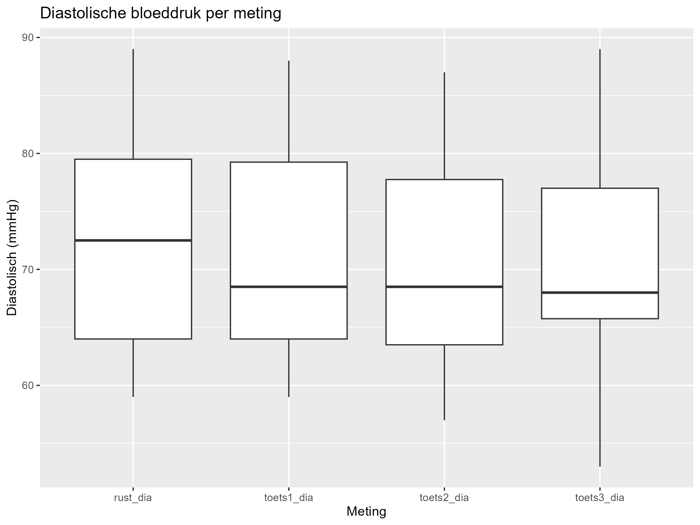
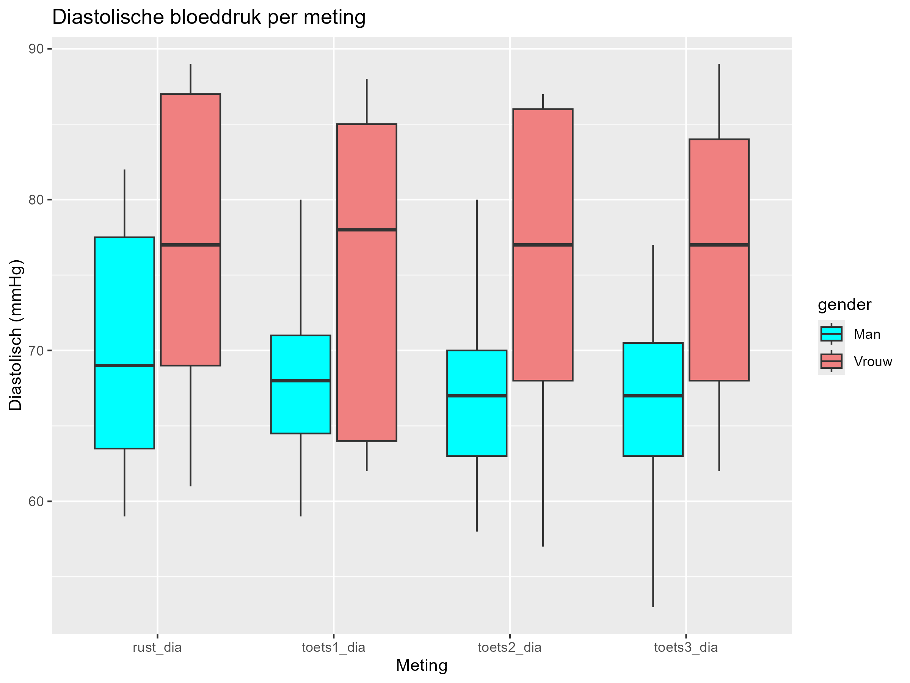
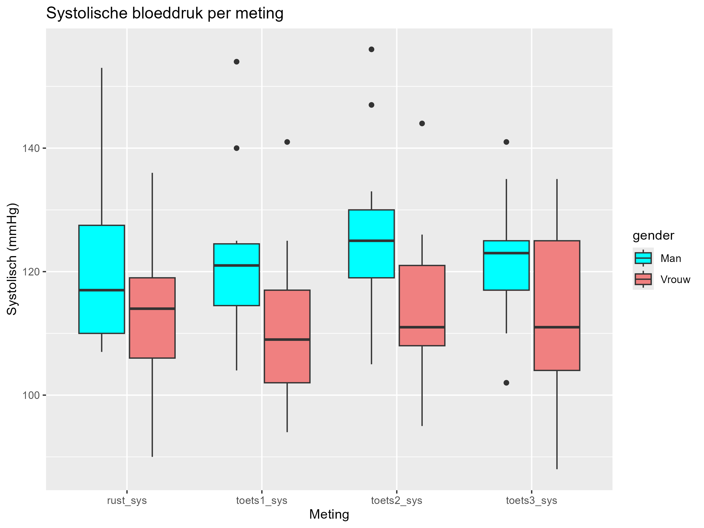
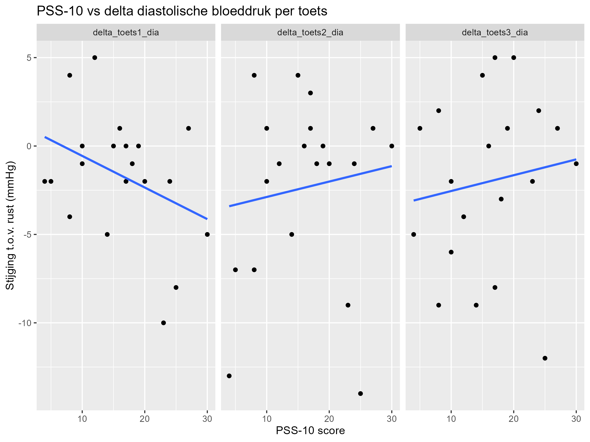
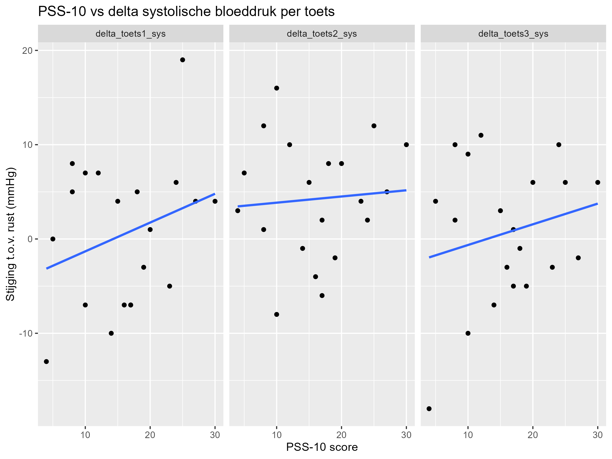

```{r setup, include=FALSE}
knitr::opts_chunk$set(echo = TRUE)
```

# 

## Introductie

Uit het rapport MMMS (Monitor Mentale Gezondheid en Middelengebruik Studenten hoger onderwijs) van 2023 blijkt dat veel studenten op het HBO en WO nog stress ervaren (Jolien Dopmeijer et al., (2023). Studenten ervaren meer stress tijdens een toetsweek dan tijdens een normale week en mensen met hogere stress scoren slechter op toetsen (Jennifer A. Heissel et al , 2021). 
Een misconceptie binnen het onderwijs is dat mensen die goed ingelezen op een onderwerp zijn, sneller onderwerp gerelateerde problemen kunnen beantwoorden of oplossen. Dit is de reden dat binnen het onderwijs tijdsdruk wordt gebruikt tijdens het toetsen van kennis. Echter is dit toch niet een goede manier om studenten te scoren op hun kennis over het onderwerp, omdat ieder persoon informatie op een andere manier verwerkt. Studenten met betere kennis nemen vaak juist meer de tijd bij moeilijke vragen, omdat ze het goed willen beantwoorden. Tijdsdruk meet eerder snelheid en hoe effectief je met stress om kan gaan Andrew J. Browning. (datum onbekend).
Omdat stress bij het maken van toetsen een negatieve impact heeft op je prestatie (Jennifer A. Heissel et al., 2021), wordt in dit onderzoek beter in kaart gebracht hoe stress wordt ervaren tijdens het maken van toetsen onder tijdsdruk. 
Stress is een psychologisch verschijnsel dat wordt veroorzaakt door een moeilijke of spannende situatie. Stress is een natuurlijke menselijke reactie die ervoor zorgt dat mensen uitdagingen en bedreigingen in hun leven aanpakken. Iedereen ervaart stress in zekere mate, en reageert hier op een andere manier op. [1]
Een kleine hoeveelheid stress is prima en kan zorgen voor meer motivatie bij dagelijkse activiteiten. Een te grote hoeveelheid stress kan echter fysieke gezondheidsproblemen veroorzaken, zoals hoofdpijn, maagklachten of slaapproblemen, maar ook mentale gezondheidsproblemen zoals depressie en angst. Stress kan ervoor zorgen dat een persoon niet kan ontspannen en kan gepaard gaan met angst en prikkelbaarheid. Ook kan het de concentratie negatief beïnvloeden. [1]
Bij een acute stressreactie worden stresshormonen vrijgelaten, namelijk cortisol en adrenaline. Dit zorgt voor waarneembare lichamelijke veranderingen, zoals een verhoogde hartslag en bloeddruk. [3]
De bloeddruk is de kracht waarmee het bloed tegen de arteriën aan drukt. Een bloeddruk bestaat uit een bovendruk en een onderdruk. Je spreekt van bovendruk zodra je hart samentrekt en het bloed door je arteriën pompt. Onderdruk is druk die wordt gemeten tijdens de rustperiode van je hart. De bloeddruk wordt gemeten in millimeter kwik, mmHg (hartstichting - bloeddruk, 2026).
Het gehele proces van het samentrekken van het hart en de rustperiode, waarbij de holtes zich vullen met bloed, noem je één hartslag. De hartslag wordt aangestuurd door elektrische prikkels die door het hart lopen waarbij eerst de boezems samentrekken en daarna de kamers (hartstichting - hartslag, 2026)
(hartstichting - bouw-en-werkin-hart, 2026).

De frequentie van dit proces wordt gemeten in hartslagen per minuut en wordt ook wel de hartfrequentie (hf) genoemd  (ahealthylife - hf, 2026).

Joan Bunyi et al. (2015) hebben vergelijkbare metingen gedaan en vragen gesteld als in deze studie wordt onderzocht, met de uitsluiting dat ook de ademhalingsfrequentie wordt gemeten. De conclusie slaat neer op dat er geen significante verandering is in de bloeddruk en hartslag tijdens het toetsen onder tijdsdruk. Wel was er een duidelijk verschil te zien in de ademhalingsfrequentie. De onderzoekers denken dat de reactie per student erg variabel is en daarom moeilijk meetbaar is. Echter kwam er uit dat de testscores slechter werden in de latere testen.
Dit onderzoek heeft als doel aan te tonen dat deze stressreactie optreedt bij studenten tijdens toetssituaties. De centrale onderzoeksvraag is of tijdsdruk invloed heeft op de prestatie, bloeddruk en hartslag. Daarnaast worden twee nevenvragen onderzocht: of dagelijkse stress — gemeten via een PSS-vragenlijst (Perceived Stress Scale, 2026) — invloed heeft op het gemeten verschil in bloeddruk, hartslag of prestatie, en of biologisch geslacht een rol speelt in de gevonden resultaten. Op basis van de uitkomsten van Joan Bunyi et al. (2015) verwachten wij geen significante verandering in bloeddruk en hartslag tijdens het maken van toetsen onder verschillende tijd drukken, echter is dit een interessant vervolgonderzoek, aangezien hun methoden van meten wezenlijk verschillen met dat van ons onderzoek.


## Materiaal & methoden

Voor het interpreteren van stress meten we de bloeddruk voor en na het maken van een toets en de hartslag meten we continu. Ook laten we de persoon zijn geslacht opgeven en moet de persoon een PSS-10 invullen om dagelijks ervaren stress te meten.
De PSS-10 of Perceived Stress Scale is een psychologisch instrument gemaakt om ervaren stress van de afgelopen maand te meten. Het zijn 10 vragen die bedoeld zijn om te achterhalen hoe onvoorspelbaar, oncontroleerbaar en overbeladen een persoon zich zijn leven ervaart. De vragen zijn makkelijk te begrijpen en zijn niet inhoudelijk gebonden aan een specifieke subpopulatie groep. Uit de PSS-10 wordt een score van 0 tot 40 gehaald die aangeeft hoeveel stress je maandelijks ervaart. 
Uit onze poweranalyse is gebleken dat we een minimum sample size nodig hebben van rond de 40 personen om een merkbaar effect in ons resultaat te kunnen zien. Met een minimum van 20 proefpersonen, vanwege de korte duur van dit onderzoek.
Om ons experiment uit te voeren gaan we dus bij 40 personen die willekeurig zijn geselecteerd, de bloeddruk, hartslag en prestatie meten tijdens het maken van drie toetsen met verschillende tijds- drukken. 
Geen tijdsdruk: voor 20 sommen. 
Lichte tijdsdruk: 1 minuut voor 20 sommen
Hoge tijdsdruk: 0,5 minuut voor 20 sommen
Voor het creëren van het psychologische effect van stress onder een tijdsdruk moet je ondertussen een test maken. Deze test bestaat uit 20 makkelijk rekensommen, bestaande uit keer, plus en min van kleine omvang. Voor 3 verschillende tijd drukken zijn er 3 verschillende rekentoetsen. Elk met verschillende sommen, maar van dezelfde lengte en moeilijkheidsgraad. Hier als volgt een paar voorbeelden van rekensommen uit zo’n rekentoets.
5 x 7
21 - 13
37 + 9
De data van de rekentoetsen en de PSS worden opgenomen uit het maken van een google form. Voor het meten van de bloeddruk, hartslag en prestatie hebben we de volgende materialen nodig.
2 Omron Bloeddrukmeters
2 Polar Verity Senses
2 Telefoons die gekoppeld zijn met de apps van de bloeddruk en hartslag meter
Een laptop/computer voor het noteren van meetpunten en uitvoeren van de forms


### Protocol

Voor het verzamelen van de gegevens zullen wij medestudenten benaderen in en rondom het schoolgebouw. Elk proefpersoon wordt op een beleefde manier gevraagd of hij of zij wil deelnemen aan een klein wetenschappelijk onderzoek over de invloed van tijdsdruk op bloeddruk, hartslag en prestaties op rekentaken. Wanneer een student niet wil deelnemen, wordt deze vriendelijk bedankt en zoeken we verder naar een volgende mogelijke deelnemer. Wanneer een student wel wil deelnemen, wordt eerst kort uitgelegd wat het onderzoek inhoudt: de proefpersoon zal drie korte rekentesten maken onder verschillende niveaus van tijdsdruk, terwijl bloeddruk, hartslag en prestaties worden gemeten. Daarbij wordt benadrukt dat alle gegevens anoniem worden verzameld en dat er geen namen worden genoteerd, maar uitsluitend een nummer.
Vervolgens wordt er een google forms gegeven aan de gebruiker waar vragen in staan. Er wordt gevraagd naar de sekse van de proefpersoon, waarbij de opties man, vrouw of anders/onbekend worden gebruikt. Ook wordt de leeftijd gevraagd. Ook worden er 10 vragen gesteld om te berekenen of de proefpersoon in het dagelijks leven veel stress ervaart (de PSS).  Als de proefpersoon deze informatie niet wil geven, wordt dit geregistreerd als “anders/onbekend”. Voorafgaand aan de eerste meting krijgt de proefpersoon één minuut rust, zodat de eerste bloeddruk- en hartslag waarden niet worden beïnvloed door recente inspanning. Tijdens deze minuut moet de testpersoon volledig stilzitten met de handpalmen naar boven.
Daarna doorloopt de proefpersoon drie condities: één zonder tijdsdruk, één met matige tijdsdruk en één met hoge tijdsdruk. Bij de eerste conditie wordt de starttijd genoteerd en de eindtijd genoteerd. Tijdens deze toets wordt de hartslag continu geregistreerd via de polar verity sense. De uitslagen van de rekentoets worden verzameld en beoordeeld op het aantal correcte antwoorden, het aantal fouten en het aantal onbeantwoorde vragen. Direct na het afronden van de test wordt opnieuw de bloeddruk gemeten en wordt de hartslag kort na inspanning vastgelegd. Dit wordt voor de matige en hoge tijdsdruk herhaald.
Aan het einde van de deelname wordt gecontroleerd of alle gegevens volledig zijn ingevuld. De proefpersoon wordt vriendelijk bedankt voor de deelname en krijgt de gelegenheid om vragen te stellen. Dit proces wordt herhaald totdat er van minimaal veertig proefpersonen volledige datasets zijn verzameld, bestaande uit alle drie de condities en alle bijbehorende metingen. De gegevens worden veilig opgeslagen en uitsluitend onder participant-ID’s bewaard.


## Resultaten


### Conclusion: 
### A repeated measures ANOVA showed no significant effect of measurement type on diastolic blood pressure,
### F(3, 57) = 2.11, p = .110, ges = .009, so we will not perform a paired T test


### All p value's of 1.000 or above 0.05 are not significant. That there was a significant change
### Between rust_sys and toets2_sys and between toets2_sys and toets1_sys. Both P-value's < 0.05.
### Conclusion: toets 2 (1 minuut) caused a significant difference



### gender p = 0.055~ so not significant yet, but very borderline, worth mentioning in the final report that
### Woman tend to show a higher diastolic blood pressure than men.
### meting p = 0.105~ still the same, no significant difference across the measurements
### gender:meting p = 0.266~ no significant change, genders respond the same way across measurements. 


### gender p = 0.116~ so not significantly different systolic bloodpressure overall between the 2 genders
### meting p = 0.020 still the same significant difference across the measurements (driven by toets2, see T test above)
### gender:meting p = 0.793 no significant change, genders respond the same way across measurements. 



#### Note:
Cor and rho ranging from -1 to 1 (correlatie)
p-value < 0.05 (significant) > 0.05 (niet significant)

### Delta test 1
Cor: -0.369447 (negatieve correlatie)
p-value = 0.1089 (niet significant)

### Delta test 2
rho = 0.1016328  (kleine positieve correlatie)
p-value = 0.6698 (niet significant)

### Delta test 3
Cor: 0.1335096  (kleine positieve correlatie)
p-value = 0.5747 (niet significant)




PSS-10 vs delta systolische bloeddruk per toets 

Waarbij delta = toets bloeddruk - rust bloeddruk

#### Note:
Cor and rho ranging from -1 to 1 (correlatie)
p-value = 0.05 standard practice
p-value < 0.05 (significant) > 0.05 (niet significant)

### Delta test 1
Cor: 0.2886083 (negatieve correlatie)
p-value = 0.2172 (niet significant)

### Delta test 2
rho = 0.07559422  (kleine positieve correlatie)
p-value = 0.7514 (niet significant)

### Delta test 3
Cor: 0.2145054  (kleine positieve correlatie)
p-value = 0.3638 (niet significant)


## Conclusie & discussie


## Literatuur


